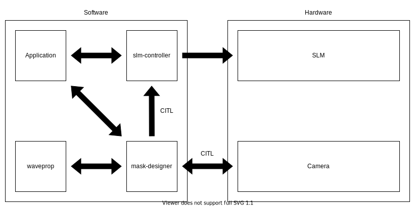
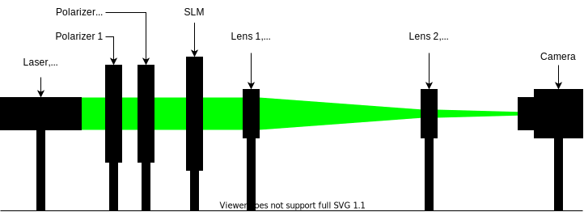

# slm-designer

Collection of different approaches to phase retrieval,
i.e. mask design for SLM devices.

- [slm-designer](#slm-designer)
  - [Installation](#installation)
  - [Manual installation needed for enabling some features](#manual-installation-needed-for-enabling-some-features)
  - [Neural Holography](#neural-holography)
  - [Camera](#camera)
  - [Experimental setup](#experimental-setup)
  - [Propagation](#propagation)
    - [Physical propagation](#physical-propagation)
    - [Simulated propagation](#simulated-propagation)
  - [Forward Problem](#forward-problem)
  - [Example scripts](#example-scripts)
    - [Aperture](#aperture)
    - [Image acquisition using IDS software and Thorlabs camera](#image-acquisition-using-ids-software-and-thorlabs-camera)
    - [Physical propagation example](#physical-propagation-example)
    - [Simulated propagation example](#simulated-propagation-example)
  - [Adding a new camera](#adding-a-new-camera)

The main goal of the project is tackle the inverse problem of phase retrieval,
i.e. mask design for SLMs.
But it also allows to explore the forward problem by setting a phase
pattern and then simply observing the output amplitude at the target plane. Mainly though, it
consists of mask design techniques that were introduced in `Neural Holography` ([paper](https://www.computationalimaging.org/wp-content/uploads/2020/08/NeuralHolography_SIGAsia2020.pdf) &
[repository](https://github.com/computational-imaging/neural-holography))
and adapted to be compliant with the remainder of this project.
Further, another part of the code does add support for cameras. Neural
Holography, amongst others, follows a `Camera-In-The-Loop` approach which involves a
camera taking pictures of the resulting interference patterns at the target
plane and then using this information to improve the designed mask iteratively.
Finally, mostly for debugging purposes, functions that allow to transform
generated phase maps using Holoeye's software or Neural Holography code into
each others assumed experimental setup and simulated propagation functions for both
settings as well are provided.

<!-- TODO what is all covered in the documentation? -->

If you wish to learn more about the evolution of our experimental setup etc. you
can refer to the `documentation/DOCUMENTATION.md`.

Here an schematic representation of the interactions between different components
used in this project.



## Installation

To install, simply run the following script:

```sh
./env_setup.sh
```

The script will:

1. Create a Python3 virtual environment called `slm_designer_env`.
2. Install Python dependencies in the virtual environment.
3. Install both [slm-controller](https://github.com/ebezzam/slm-controller) and
   [waveprop](https://github.com/ebezzam/waveprop) in setuptools “develop mode”
   from GitHub directly

This project is using those two repos to access physical SLMs after the phase
pattern has been computed and to simulate the light propagation in the different
phase retrieval algorithms or propagation simulations. Note that those are still in development too.

## Manual installation needed for enabling some features

If you plan to use the [Thorlabs
DCC3260M](https://www.thorlabs.com/thorproduct.cfm?partnumber=DCC3260M) camera
for the Camera-In-The-Loop phase retrieval method introduced by Neural
Holography you will
have to install IDS software as well. First, install [IDS Software
Suite](https://en.ids-imaging.com/download-details/AB00695.html), simply follow
the installation instructions. Next, you need [IDS
Peak](https://en.ids-imaging.com/download-details/AB00695.html) which can be
found under the same link.
This is a software package containing some GUI applications to interact with the
camera but, most importantly, contains two wheel-packages that allow to install
the python API for the aforementioned camera. First, just follow the install
instructions but then make sure to pick the `Custom` installation option to add an
important feature. Once in this selection prompt,
check the box additionally installing `Support of uEye cameras` and continue.
After the installation is completed go to the installation directory. Note
that you should have activated the virtual environment created earlier from now
on. Next, go to `ids_peak/generic_sdk/api/binding/python/wheel` and
install the appropriate wheel like so, for example:

```sh
pip install x86_64/ids_peak-1.4.1.0-cp39-cp39-win_amd64.whl
```

Secondly, again from the IDS installation
directory, go to `ids_peak/generic_sdk/ipl/binding/python/wheel`. Similar to
before install the correct version of the wheel for your setup, for example:

```sh
pip install x86_64/ids_peak_ipl-1.3.2.7-cp39-cp39-win_amd64.whl
```

Now, you should be good to go to use all the features implemented in this
project.

## Neural Holography

The authors of `Neural Holography` ([paper](https://www.computationalimaging.org/wp-content/uploads/2020/08/NeuralHolography_SIGAsia2020.pdf) &
[repository](https://github.com/computational-imaging/neural-holography))
provide implementations to different phase retrieval approaches. Here a
list of the methods that were slightly modified and hence compatible
with the remainder of the project and where to find them:

- Gerchberg-Saxton (GS)
- Stochastic Gradient Descent (SGD)
- Double Phase Amplitude Coding (DPAC)
- Camera-In-The-Loop (CITL)

GS, SGD and DPAC are all implemented inside `slm_designer/neural_holography/algorithms.py`
and PyTorch modules that go along with them are provided in
`slm_designer/neural_holography/module.py`. CITL on the other hand is located in a separate
script `slm_designer/neural_holography/train_model.py`. Note that you do
generally not need to interact with the Neural Holography code directly. A
wrapper for it is provided at `slm_designer/wrapper.py` which does simply import
code from Neural Holography so that you do not need to go lock for it in their
code and also contains some interfacing methods to run the different phase
retrieval algorithms. We'd like to remind that
this code was released under the license provided in `LICENSE` and we do not
claim any credit for it. Usage examples of all
those features will be presented in the
subsequent [Example scripts](#example-scripts) section.

## Camera

As mentioned earlier, camera play a crucial role in the CITL-approach. Hence, an
interface for such devices is needed. For now, the project only supports one
real camera, the [Thorlabs
DCC3260M](https://www.thorlabs.com/thorproduct.cfm?partnumber=DCC3260M) and a
dummy camera that simply "takes" black snapshots. Later can be useful during
development. In the future this list is going to be extended (for example with
the [Raspberry Pi HQ Camera](https://www.adafruit.com/product/4561)), but here its
current state.

Supported cameras:

- Dummy camera (artificial, returns synthetic pitch black images)
- [Thorlabs DCC3260M](https://www.thorlabs.com/thorproduct.cfm?partnumber=DCC3260M)

## Experimental setup

The experimental setup is an incremental adaption of an initial setup proposed
by Holoeye in the manual that came with their SLM. Again, for more information
refer to the `documentation/DOCUMENTATION.md`. Here, we simply present the
final version we settled for.



Further, the `slm_designer/experimental_setup.py` allows to set which camera and SLM are
used, what wavelength the laser is operating at and finally the propagation
distance (distance form the SLM to the camera sensor). Those parameters are then
used in the remainder of the code base.

<!-- TODO might not be only linked to lenses, ASM vs Fraunhofer -->

Holoeye does also provide a piece of software called [SLM Pattern
Generator](https://customers.holoeye.com/slm-pattern-generator-v5-1-1-windows/)
which amongst others has a feature that does perform phase retrieval for a given
target amplitude. One such example can be found in `images/holoeye_phase_map`
and its corresponding amplitude at the target plane under `images/target_amplitude`.
This software assumes a experimental setup that uses a lens in between the SLM and
the target plane. Neural Holography on the other hand, uses a different setting
where no lens is placed between the SLM and the target plane, i.e. a lensless
setting. Those differences impact the resulting phase map of the mask design
algorithm. The methods in `slm_designer/transform_fields.py` allow transforming phase maps,
fields, back and forth between both settings. Note that Neural Holography encodes
phase maps, images etc. as 4D PyTorch Tensors where the dimensions are [image,
channel, height, width]. But again, the wrapper `slm_designer/wrapper.py` does
provide interfacing methods for the different algorithms that handle all those complications for you and you
are not required to dig any deeper than that.

## Propagation

<!-- TODO might not be only linked to lenses, ASM vs Fraunhofer -->

This section will briefly discuss the propagation of a phase map to the target
plane. More precisely propagation simulation is a crucial element in most of the
mask designing algorithms. Holoeye's SLM Pattern Generator uses
[Fraunhofer](https://en.wikipedia.org/wiki/Fraunhofer_diffraction_equation) and
Neural Holography mostly uses the [Angular spectrum
method](https://en.wikipedia.org/wiki/Angular_spectrum_method) ASM. In a next step
we plan to replace the ASM implemented in Neural Holography with a propagation
method from [waveprop](https://github.com/ebezzam/waveprop).

### Physical propagation

Physical propagation refers to the process of physically displaying a phase map
on a SLM and then observing the resulting images at the target plane. That's where the
[slm-controller](https://github.com/ebezzam/slm-controller) comes in handy to
communicate with the physical SLMs. Note that this software package simply plots
the phase map whenever something goes wrong with showing it on the physical
device so that you can still get an idea of the resulting phase maps. Usage
examples will be presented in the
subsequent [Example scripts](#example-scripts) section.

### Simulated propagation

Opposed to physical propagation, here the propagation is only simulated. No
physical SLM is involved. This feature is specially useful for working, testing,
debugging when not having access to all the material needed to do the physical
propagation. As explained earlier ([Propagation](#propagation)) Holoeye and
Neural Holography assume different experimental setups. Hence, methods are
provided to simulated propagation in both settings in
`slm_designer/simulate_prop.py`. Additionally, a whole bunch of methods from
waveprop are added in the script, unfortunately not all those are properly
woring for now. Usage examples will be presented in the
subsequent [Example scripts](#example-scripts) section.

## Forward Problem

## Example scripts

In `examples` are various example scripts that showcase all
the features integrated into the project.

First, activate the virtual environment:

```sh
source slm_designer_env/bin/activate
```

You can exit the virtual environment by running `deactivate`.

### Aperture

To set a defined aperture shape, check out the following script:

```sh
>> python examples/set_aperture.py --help

Usage: set_aperture.py [OPTIONS]

  Set aperture on a physical device.

Options:
  --shape [rect|square|line|circ]
                                  Shape of aperture.
  --n_cells INTEGER               Side length for 'square', length for 'line',
                                  radius for 'circ'. To set shape for 'rect',
                                  use`rect_shape`.

  --rect_shape INTEGER...         Shape for 'rect' in number of cells; `shape`
                                  must be set to 'rect'.

  --vertical                      Whether line should be vertical (True) or
                                  horizontal (False).

  --device [rgb|binary]           Which device to program with aperture.
  --help                          Show this message and exit.
```

For example, to create a circle aperture on the monochrome device with a radius of 20 cells:

```sh
python examples/set_aperture.py --device binary --shape circ --n_cells 20
```

For a square aperture on the RGB device with a side length of 2 cells:

```sh
python examples/set_aperture.py --device rgb --shape square --n_cells 2
```

You can preview an aperture with the following script. Note that it should be run on a machine with
plotting capabilities, i.e. with `matplotlib`.

```sh
>> python examples/plot_aperture.py --help

Usage: plot_aperture.py [OPTIONS]

  Plot SLM aperture.

Options:
  --shape [rect|square|line|circ]
                                  Shape of aperture.
  --n_cells INTEGER               Side length for 'square', length for 'line',
                                  radius for 'circ'. To set shape for 'rect',
                                  use`rect_shape`.

  --rect_shape INTEGER...         Shape for 'rect' in number of cells; `shape`
                                  must be set to 'rect'.

  --vertical                      Whether line should be vertical (True) or
                                  horizontal (False).

  --show_tick_labels              Whether or not to show cell values along
                                  axes.

  --pixel_pitch FLOAT...             Shape of cell in meters (height, width).
  --slm_shape INTEGER...          Dimension of SLM in number of cells (height,
                                  width).

  --monochrome                    Whether SLM is monochrome.
  --device [rgb|binary]           Which device to program with aperture.
  --help                          Show this message and exit.
```

For example, to plot a square aperture on the RGB device with a side length of 2 cells:

```sh
python examples/plot_aperture.py --shape square --n_cells 2 --device rgb
```

### Image acquisition using IDS software and Thorlabs camera

This file illustrates how a camera, here the `IDSCamera`, is instantiated and
used to take a single image.

```sh
python examples/ids_image_capture.py
```

### Physical propagation example

This section contains two scripts, one for sending a phase map created using the
Holoeye software to the Holoeye SLM and another one doing the same for sending
phase maps generated using Neural Holography methods. Note that the
transformation method for the phase maps implemented in
`slm_designer/transform_fields.py` are crucial here.

```sh
>> python examples/physical_prop_holoeye.py --help
Usage: physical_prop_holoeye.py [OPTIONS]

Options:
  --show_time FLOAT  Time to show the pattern on the SLM.
  --help             Show this message and exit.
```

```sh
>> python examples/physical_prop_neural_holography.py --help
Usage: physical_prop_neural_holography.py [OPTIONS]

Options:
  --show_time FLOAT  Time to show the pattern on the SLM.
  --help             Show this message and exit.
```

### Simulated propagation example

Same as above, two versions of the simulated propagation do exist, one for
Holoeye phase maps and another one for the phase maps computed with Neural
Holography methods. Again, the functions in `slm_designer/transform_fields.py`
are important here. As a sanity check each phase map is transformed into both
settings and the its propagation is simulated in the respective setting. The
resulting amplitude patterns must be the same.

```sh
python examples/simulate_prop_holoeye.py
```

```sh
python examples/simulate_prop_neural_holography.py
```

## Adding a new camera

1. Add configuration in `slm_designer/hardware.py:cam_devices`.
2. Create class in `slm_designer/camera.py`.
3. Add to factory method `create_camera` in `slm_designer/camera.py`.
