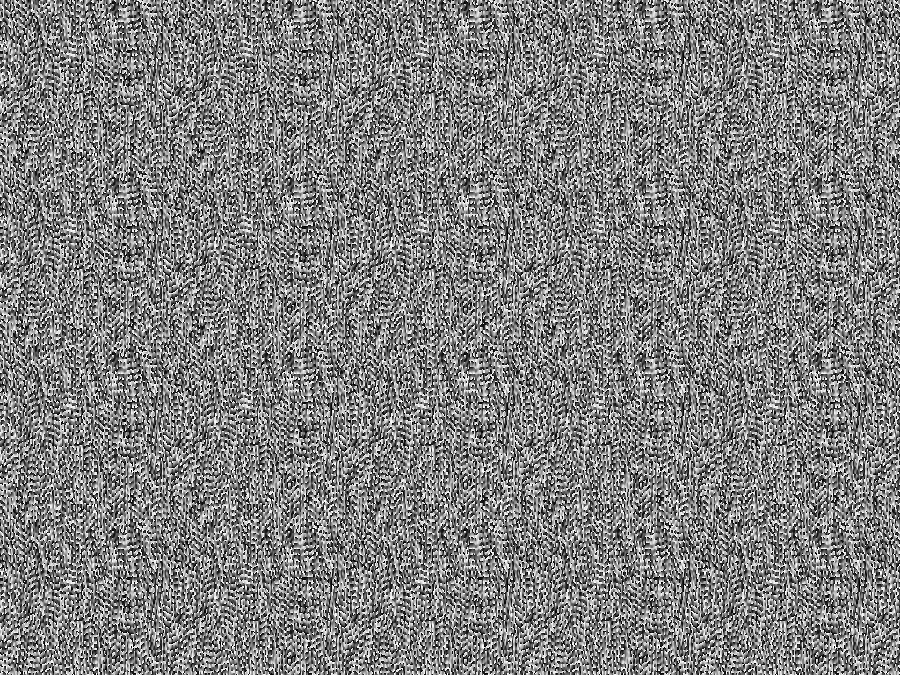
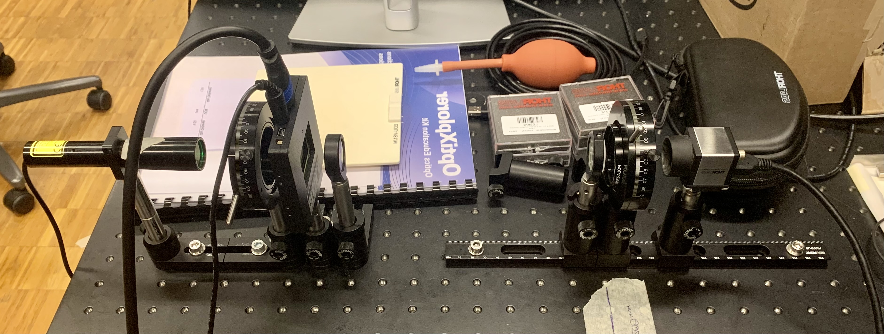
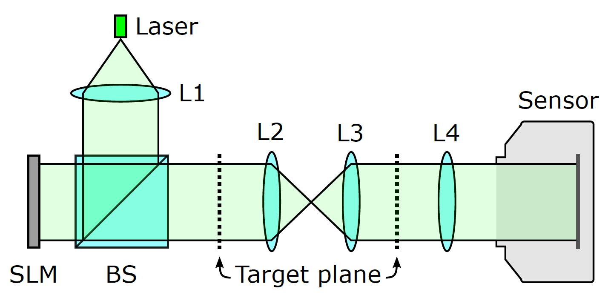

Documentation
=============

.. contents:: Table of Contents
   :depth: 5

Overview
--------

More as a reminder and complementary to the ``README.rst``, we are quickly going over
the main goals and concepts used in this package.

SLMs
^^^^

Spatial Light Modulators (SLMs) are devices that modulate properties of light,
either its amplitude, phase or polarization in space or time and can be reflective or transmissive.
Here an example of a SLM we support (via `slm-controller <https://github.com/ebezzam/slm-controller>`_) in this project, the `Holoeye LC
2012 <https://holoeye.com/lc-2012-spatial-light-modulator/>`_.

.. figure:: images/slm.png
   :target: images/slm.png
   :alt: Holoeye slm

   **Image Credits - Reference [1]**

It's a transmissive SLM and allows to modulate both amplitude and phase.
Commonly SLMs, and also the Holoeye one, are based on Liquid Crystal Display
(LCD) technology. Briefly, the SLM consists of a grid of crystal cells where
each of them can be programmatically addressed and by applying
different voltages its physical properties are changed. Concretely, for the
Holoeye SLM Twisted Nematic (TN) cells are used. Here two image that sum
this up:

   **Image Credits - Reference [1]**

This picture shows such a TN cell when no voltage is applied. The polarization
of the light follows the crystal molecules and is hence rotated by :math:`90°`.

.. figure:: images/tn_lc.png
   :target: images/tn_lc.png
   :alt: Holoeye slm

   **Image Credits - Reference [1]**

When a voltage is applied the twist in the helix is altered leading to different
properties. More precisely, :math:`V_A = 0` with
twisted, but untilted molecules, :math:`V_B > V_{thr}` with tilted, partially
aligned molecules, :math:`V_C \gg V_{thr}` with aligned molecules in the central region
of the cell.

By modulating the polarization and combining the SLM with a polarizer and an
analyzer both amplitude and phase modulation can be achieved.

SLMs generally have different fields of application like, for example, Lensless
Imaging but in this project the focus lies on Computer Generated Holography (CGH).
In this domain the goals is to produce interesting interference patterns of
light waves, like images etc. Generally, it's a hard problem to prepare such
holographic light waves that then can be transported to an observer leading to
the expected output. Nonetheless, it can be done using fixed masks but it's way
more interesting to use SLMs for this task, being programmatically
changeable. Next, we are going to focus on how to prepare such holographic light
waves using SLMs to modulate the lights phase, more precisely on how to compute
the mask that needs to be put
on those devices. This problem is commonly called phase retrieval.

Phase retrieval
^^^^^^^^^^^^^^^

.. TODO only phase slms?

This package is intended to provide different approaches to the inverse problem called phase
retrieval, i.e. mask design for phase SLMs. So concretely, those algorithms aim to
compute a phase mask that can be set on a SLM such that a given target image is
appearing on the screen ofter propagation of the light waves. For example, we
want to get this target amplitude.

.. figure:: ../../images/target_amplitude/holoeye_logo.png
   :target: ../../images/target_amplitude/holoeye_logo.png
   :alt: Holoeye logo

   **Image Credits - Reference [2]**

Any of those algorithms then computes the corresponding phase map.

And finally, this phase mask can be sent to a SLM and propagated to the target
plane where one can observe the resulting image.

.. image:: images/holoeye_logo_propagated.png
   :target: images/holoeye_logo_propagated.png
   :alt: Holoeye logo propagated

To interact and control such SLM devices this package depends on a different
package `slm-controller <https://github.com/ebezzam/slm-controller>`_ which is
developed jointly with this package.

For most of these phase retrieval algorithms light propagation simulation plays
an essential role. That is, simulating light waves with given phase
values propagating to the target plane and predicting the resulting amplitudes.
For now those simulations are not performed with our in house package
`waveprop <https://github.com/ebezzam/waveprop>`_ but it is our goal to use it
throughout the code.

The mask-designer includes more features but mask designing is the main problem
it tackles. The different strategies are more or less directly imported from `GitHub <https://github.com/computational-imaging/neural-holography>`_. As
shown in the
`paper <https://www.computationalimaging.org/wp-content/uploads/2020/08/NeuralHolography_SIGAsia2020.pdf>`_
that goes with the repository, a ``Camera-In-The-Loop`` (CITL) approach leads to the best
results. This technique includes capturing images of the resulting amplitudes at
the target plane and using this information to improve the phase map
iteratively. But these approaches are explained in more depth in the `Neural
Holography <#neural-holography>`_ section. For CITL though, interaction with
a camera is needed which this package provides an interface for.

Overall the following schematic shows the interactions between the different
software and hardware modules that normal use cases would produce.

.. raw:: html
   :file: images/structure.svg

The interactions marked with *CITL* are only necessary for the CITL approach.
More details are given in the `Typical interactions between software and hardware <#typical-interactions-between-software-and-hardware>`_ section.

Holoeye SLM Pattern Generator
-----------------------------

Holoeye does also provide a piece of software called `SLM Pattern
Generator <https://customers.holoeye.com/slm-pattern-generator-v5-1-1-windows/>`_
which amongst others has a feature that does perform phase retrieval for a given
target amplitude. One such example can be found in ``images/holoeye_phase_mask``
and its corresponding amplitude at the target plane under
``images/target_amplitude``.

This code is unfortunately not open-source but they claim to use an Iterative
Fourier Transform Algorithm (IFTA) summed up in the following diagram.

   **Image Credits - Reference [3]**

The Discrete Fourier Transform (DFT) here does perform propagation simulation in
the `Fraunhofer <https://en.wikipedia.org/wiki/Fraunhofer_diffraction_equation>`_
sense. All in all, the IFTA is probably the easiest approach to phase retrieval,
iteratively enforcing constraints (as being close to the target amplitude on the
target plane) and propagating back and forth (i.e.
simulating the wave propagation). Neural Holography does implement the
Gerchberg-Saxton algorithm which is basically the same.

Neural Holography
-----------------

The authors of ``Neural Holography`` (`paper <https://www.computationalimaging.org/wp-content/uploads/2020/08/NeuralHolography_SIGAsia2020.pdf>`_ &
`repository <https://github.com/computational-imaging/neural-holography>`_)
provide implementations to different phase retrieval approaches. Here a
list of the methods that were slightly modified and hence are now compatible
with the remainder of the project:

#. Gerchberg-Saxton (GS)
#. Stochastic Gradient Descent (SGD)
#. Double Phase Amplitude Coding (DPAC)
#. Camera-In-The-Loop (CITL)

1. Gerchberg-Saxton (GS)
^^^^^^^^^^^^^^^^^^^^^^^^

As mentioned earlier, this is basically the IFTA. Light is iteratively
propagated back and forth and constraints are enforced at both ends, like being
close to the target amplitude at the target plane.

2. Stochastic Gradient Descent (SGD)
^^^^^^^^^^^^^^^^^^^^^^^^^^^^^^^^^^^^

Similar to before, the phase mask is iteratively optimized such that the
resulting amplitude after propagation is closer and
closer to the target amplitude. Note that this methods requires the light
propagation to be differentiable. Additionally, this method uses a region of
interest (ROI) in which errors are more penalized than on the outside of this
region. So typically you want the result to be close to the target in the center
but give the
algorithm some slack in the border regions. This simplifies the optimization
task as you do not force the algorithm to optimize regions which you do not care
about. Generally speaking, you require fewer iterations and hence get some speedup.

3. Double Phase Amplitude Coding (DPAC)
^^^^^^^^^^^^^^^^^^^^^^^^^^^^^^^^^^^^^^^

.. TODO remove dpac

As the only one of those 4 algorithms, DPAC is a single shot algorithm, it's
non-iterative. When looking at the results presented in the Neural Holography
paper, one can clearly see that it yields worse results than the other methods,
which is quite intuitive as it's much faster to run. But practically we never
got satisfying results from it. The performance does not seem to come close to
the one reported in the paper. For now we didn't find any good reasons for this
performance mismatch but this is something that needs further investigation.

4. Camera-In-The-Loop (CITL)
^^^^^^^^^^^^^^^^^^^^^^^^^^^^

CITL adds physical propagation and the measurement of those results into the
game. The idea is to compute a phase mask (for example with SGD), propagate
it physically using a SLM, then measuring the resulting amplitudes on the target
plane using a camera and finally using those observations to improve the phase
map further before repeating these steps. So this approach is iterative.
Additionally, it is technically the most challenging one. But as shown in the Neural
Holography paper it performs better than all the other methods. At the current
state of the project. the training of the CITL is functional but more work needs to be done in
order to make it truly useable and testable.

Typical interactions between software and hardware
--------------------------------------------------

The following gif-files illustrate the interactions between software and hardware
components that arise normally in typical use cases.

Set a mask using ``slm-controller``
^^^^^^^^^^^^^^^^^^^^^^^^^^^^^^^^^^^^^^^

.. image:: gifs/slm-controller.gif
   :target: gifs/slm-controller.gif
   :alt: Schematic representation of the interactions between different components

Perform phase retrieval (not CITL)
^^^^^^^^^^^^^^^^^^^^^^^^^^^^^^^^^^

Perform phase retrieval using CITL
^^^^^^^^^^^^^^^^^^^^^^^^^^^^^^^^^^

Perform phase retrieval using CITL and ``waveprop`` for simulation
^^^^^^^^^^^^^^^^^^^^^^^^^^^^^^^^^^^^^^^^^^^^^^^^^^^^^^^^^^^^^^^^^^^^^^

.. image:: gifs/waveprop.gif
   :target: gifs/waveprop.gif
   :alt: Schematic representation of the interactions between different components

Experimental setup
------------------

Final setup
^^^^^^^^^^^

Before going into the incremental steps that lead to the final setup we just
want to present the final version.

.. raw:: html
   :file: images/setup.svg

And here a picture taking of it in the lab.

Focusing the optical system with the two lenses exactly on the photo sensor is a
bit tricky. By experience it is easiest to fix the convex lens and then moving
the concave lens and the camera in such a way that both scaling and focus are
good. Additionally, one can compute the exact focus plane of the lenses once you
found a configuration which is close to the scaling you are looking for.
Consider the following diagram.

.. TODO move convex lens more to the right
.. raw:: html
   :file: images/lenses_diagram.svg

Hence, one can derive a formula for :math:`b`.

..  TODO does not work in html generated using sphinx
..  TODO Actually we use -30 !!!

.. math::
   \begin{align}
   \frac{1}{-30}=\frac{1}{b}-\frac{1}{a} &\iff \frac{1}{b}=\frac{1}{a}-\frac{1}{30} \\
   &\iff b=\left(\frac{1}{a}-\frac{1}{30}\right)^{-1} \\
   &\iff b=\left(\frac{1}{200-c}-\frac{1}{30}\right)^{-1} \\
   \end{align}

with :math:`a=200-c` and :math:`170 < c < 200`.

Incremental development of final setup
^^^^^^^^^^^^^^^^^^^^^^^^^^^^^^^^^^^^^^

In this next section, we are going to walk through the different experimental
setups we tested to finally converge to the final setup. As a general rule we
found it to be way easier to use a camera with an exposed photo sensor i.e. with
no optics at all. Otherwise perfect alignment was tricky to achieve and all the
inconveniences of a bare bone senor could be resolved fairly easily. But you can
also use a simply screen instead of camera to avoid those complications.

Version 1
~~~~~~~~~

This setup was the simplest setup that was proposed in the ``OptiXplorer`` manual
that came with the Holoeye SLM. It's a starting point and conceived to built
upon. Note that both lenses and the SLM generally have a preferred orientation.
Additionally, for best results the laser beam should be collimated (all it's
rays should be parallel). The camera should be placed at the focal distance of
the convex lens.

.. raw:: html
   :file: images/setup_1.svg

Version 2
~~~~~~~~~

In the same manual it is suggested to place the SLM after the lens because this
does not affect the resulting interference pattern but the
relative position of the SLM in between the lens and the camera changes the
scale of that pattern. Hence, by moving the the SLM closer to the camera the image size is
reduced and makes it easy to scale the size of the interference pattern to
perfectly match the photo sensor of the camera.

.. raw:: html
   :file: images/setup_2.svg

Version 3
~~~~~~~~~

Again, suggested by the manual, a polarizer (:math:`-45°`) and an analyzer (:math:`15°`) are
added to the very front and the very back of the optical pipeline respectively.
Those are the required settings according to Holoeye for the SLM to perform
optimally as a phase SLM.

.. raw:: html
   :file: images/setup_3.svg

Version 4
~~~~~~~~~

A second lens, this time a concave one, is added to the optical setup which
allows to change the scaling of the interference pattern. The
relative position of the to lenses determines the scale (and the position of the
SLM).

.. raw:: html
   :file: images/setup_4.svg

This setup was the final version suggested by Holoeye but we experienced
several issues and problems with it. Firstly, having the SLM after the first lens
creates a situation where the laser beam that enters the SLM actually is no
longer collimated which goes against what was suggested earlier. Visually it
seems to make not a big difference as the convex lens has a rather big focal
distance the beam is still close to being collimated. Nonetheless, it is cleaner
to put the SLM in front of any lens and handle the scaling of the interference
pattern differently. And adding the concave lens gave us another way of
manipulating the scale. Secondly, we experienced oversaturation of the photo sensor
even with the shortest exposure times possible with Thorlabs software
(`ThorCam <https://www.thorlabs.com/software_pages/ViewSoftwarePage.cfm?Code=ThorCam>`_)
that natively comes with the camera. A handy
way of controlling the
amount of light, i.e. its intensity, is to use two polarizers back to back and
turning them relative to each other such that just the right amount of light
passes through them. Instead of adding a third polarizer we simply moved the analyzer
in between the polarizer and the SLM. The removal of the analyzer did not
visually degrade the results. But it would be cleaner to follow Holoeye
suggestions here.

Version 5
~~~~~~~~~

For simplicity, we first only used one lens to test if our changes to the setup
where a step in the right direction. And indeed they where. Note that in order
to stay as close to Holoeye's setup the input polarization of the light
hitting the SLM was not changed. We no longer had any
issues with the light intensity as the back to back polarizers provide an
efficient way of controlling the light intensity parameter. But, as expected, the resulting
pattern was pretty small and hence we needed to address the scaling issue.

.. raw:: html
   :file: images/setup_5.svg

Final version
~~~~~~~~~~~~~

Adding the concave lens back into the setup solved the scaling issue. Thus, we
settled for the final configuration.

.. raw:: html
   :file: images/setup.svg

Candidate setup to test
^^^^^^^^^^^^^^^^^^^^^^^

As mentioned earlier, removing the analyzer and using it in the back to back
polarizer pair didn't harm the visual results but still is not what was suggested
by Holoeye. Hence, either we should use 3 polarizers or find another solutions.
Luckily, testing other software that allows to control the camera (`IDS
Peak <https://en.ids-imaging.com/download-details/AB00695.html>`_) enabled even
lower exposure times. So low that the intensity of the laser beam did not
oversaturate the photo sensor, even without the back to back polarizer pair anymore. The
shorter exposure time might lead to more noise but this is something
worth investigating further. Hence, we could use the two polarizers as intended by
Holoeye, leading to this candidate setup that we will evaluate in the future.

.. raw:: html
   :file: images/setup_candidate.svg

Propagation
-----------

Following Holoeye's manual, those setup all include one convex lens.
Neural Holography on the other hand, uses a different setting where no lens is
placed between the SLM and the target plane, i.e. a lensless setting (at least
in the first part of their optical configuration).

   **Image Credits - Reference [4]**

A convex lens is physically performing a Fourier transform, hence those settings
are not compatible with each other, meaning that a phase mask computed using
Neural Holography code won't result in the desired amplitudes on the photo sensor
and vice versa for the same target amplitude.

Hence, our physical setup does perform propagation in the
`Fraunhofer <https://en.wikipedia.org/wiki/Fraunhofer_diffraction_equation>`_
sense, where the propagation basically boils down to applying a Fourier
transform. This fact was confirmed by simulating propagation using Fraunhofer of phase maps
generated by Holoeye software and comparing the results to physical observations
with our experimental setup (including one convex lens).

Additionally, Neural Holography uses a different propagation method, namely `Angular spectrum
method <https://en.wikipedia.org/wiki/Angular_spectrum_method>`_ (ASM). To
summarize, we have those differences in propagation:

.. raw:: html
   :file: images/propagation.svg

.. TODO above, we propagate the field not only the phase mask

Thus for the ``same target amplitude`` we obtain ``different phase maps`` where the
difference is not explained with numerical variations.

Mathematically, we have that

.. TODO review the approx, coloneqq is not supported by sphinx

.. math::
   \begin{align}
   A &\approx (FT \circ S)(\phi_H) \colonequals p_H(\phi_H) \\
   A &\approx (IS \circ FT \circ S \circ M \circ IFT \circ S)(\phi_N) \coloneq p_N(\phi_N) \\
   \end{align}

but :math:`\phi_H \neq \phi_N` and where

* :math:`A` is the amplitude at the target plane of the propagated light,
* :math:`\approx` expresses the fact that those methods results in the "same"
  amplitudes up to some numerical errors,
* :math:`\phi_H` is the phase mask computed using Holoeye software,
* :math:`\phi_N` is the phase mask computed using Neural Holography code,
* :math:`FT` is a regular Fourier transform,
* :math:`IFT` its inverse transform,
* :math:`S` simply shifts i.e. rotates part of the Tensors,
* :math:`IS` does the inverse shift and
* :math:`M` is a matrix multiplication by the homography matrix :math:`H` computed internally.

In order to be able to use the Neural Holography code (same goes
the other way around) we need to be able to transform the phase maps. We get

.. math::
   \begin{align}
   \phi_N&=(IS \circ FT \circ S \circ M \circ IFT \circ IFT)(\phi_H) \coloneqq t_{H \rightarrow N}(\phi_H) \\
   \phi_H&=(FT \circ FT \circ S \circ M^{-1} \circ IFT \circ S)(\phi_N) \coloneqq t_{N\rightarrow H}(\phi_H) \\
   \end{align}

and hence we have that

.. math::
   \begin{align}
   A &\approx p_H(\phi_H)=(p_H \circ t_{N\rightarrow H})(\phi_N) \\
   A &\approx p_N(\phi_N)=(p_N \circ t_{H\rightarrow N})(\phi_H) \\
   \end{align}

as desired. In diagrammatic form we have the following situation:

.. raw:: html
   :file: images/transformation.svg

Both these transformations are implemented in
``mask_designer/transform_fields.py``. Note that the wrapper
``mask_designer/wrapper.py`` provides interfacing methods for Neural Holography phase retrieval
algorithms that also handle the transformation to our setup which includes a
convex lens.

References
----------

* [1] Holoeye OptiXplorer Manual
* [2] Holoeye OptiXplorer Software
* [3] Frank Wyrowski and Olof Bryngdahl, "Iterative Fourier transform algorithm
  applied to computer holography," J. Opt. Soc. Am. A 5, 1058-1065 (1988)
* [4] Peng, Yifan & Choi, Suyeon & Padmanaban, Nitish & Wetzstein, Gordon. (2020).
  Neural holography with camera in the loop training. ACM Transactions on
  Graphics. 39. 1-14. 10.1145/3414685.3417802.
