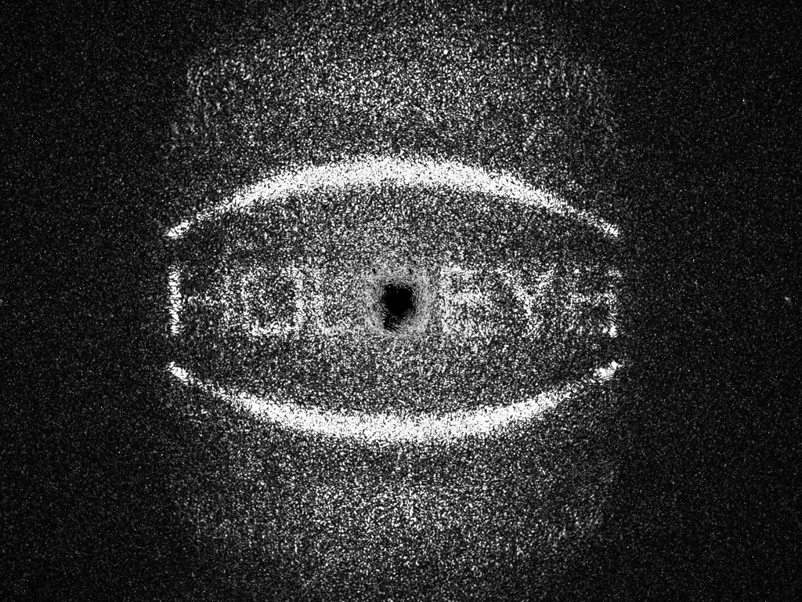

Example scripts results
=======================

On this page of the documentation we show images of results one can
expect to obtain when running the code
examples provided with this repo.

In ``examples`` are various example scripts that showcase the main features
of this repository.

First, activate the virtual environment:

.. code-block:: sh

   source mask_designer_env/bin/activate

You can exit the virtual environment by running ``deactivate``.

Lens examples
-------------

GS
^^^^

.. code-block:: sh

   python examples/lens/run_gs.py

The simulated results should be similar to the following:

.. image:: images/res_lens_gs_1.png
   :target: images/res_lens_gs_1.png
   :align: center
   :alt: Lens GS 1

And the corresponding captured image should look something like:

Holoeye
^^^^^^^

.. code-block:: sh

   python examples/lens/run_holoeye.py

The simulated results should be similar to the following:

And the corresponding captured image should look something like:

.. image:: images/res_lens_holoeye_2.png
   :target: images/res_lens_holoeye_2.png
   :align: center
   :alt: Lens Holoeye 2

SGD using CITL
^^^^^^^^^^^^^^

.. code-block:: sh

   python examples/lens/run_sgd_citl.py

Here is the simulated result of the "warm start" phase which only runs normal SGD.

.. image:: images/res_citl_sim_warm_start.png
   :target: images/res_citl_sim_warm_start.png
   :align: center
   :alt: Lens SGD CITL

And here is the captured image of the resulting amplitude of the "warm start" phase.

.. image:: images/res_citl_phy_warm_start.png
   :target: images/res_citl_phy_warm_start.png
   :align: center
   :alt: Lens SGD CITL

For improving the results, we capture the 0th order refraction by simply program
a blank phase mask to the SLM and capturing the resulting amplitude. This is
then set as corrective image inside the ``Camera`` class, and hence subtracted
from all subsequent images that are taken with the camera.

.. image:: images/res_citl_phy_correction.png
   :target: images/res_citl_phy_correction.png
   :align: center
   :alt: Lens SGD CITL

Hence, when programming the phase mask corresponding to the grid used for
calibration we obtain the following result (note how the 0th order is filtered
out now):

Unfortunately, this way of handling the 0th order and also the overall quality
of the above image leads to the calibration process to fail. Further tweaking of
parameters for the blob detector and the different filters etc. is needed.
Nonetheless, we almost get all of the dots correctly matched:

.. image:: images/res_citl_sim_calib.png
   :target: images/res_citl_sim_warm_start.png
   :align: center
   :alt: Lens SGD CITL

When ignoring that the calibration failed, we 
can run the actual optimization using the camera. The following image shows the
simulated result after an iteration:

And here the corresponding captured image:

At the current state, we run into a problem at this stage which will require
some debugging in the future. In the subsequent iterations all the gradients of
the phase mask are ``None`` and hence the SGD does not further progress except
reducing the scaling factor of the phase mask which does not change the phase
mask itself. Here the output we get in the command line:

.. code-block:: sh

  python examples/lens/run_sgd_citl.py
  Program mask onto the physical SLM.
  15:23:54.833989 Start imshow
  Program mask onto the physical SLM.
  15:23:58.315224 Start settle
  15:23:58.570841 End settle, start capture
  15:24:01.862928 End capture
  15:24:04.860459 End imshow
  15:24:05.442145 Start imshow
  Program mask onto the physical SLM.
  15:24:08.283236 Start settle
  15:24:08.536671 End settle, start capture
  15:24:11.972557 End capture
  15:24:15.478135 End imshow
     - Calibration failed
  15:24:16.298924 Start imshow
  Program mask onto the physical SLM.
  15:24:19.772224 Start settle
  15:24:20.023749 End settle, start capture
  15:24:20.350141 End capture
  15:24:26.692450 End imshow
  15:24:26.788523 Start imshow
  Program mask onto the physical SLM.
  15:24:30.325651 Start settle
  15:24:30.580847 End settle, start capture
  15:24:30.905616 End capture
  15:24:37.320012 End imshow
  Traceback (most recent call last):
    File "C:\Users\baehl\workspaces\mask-designer\examples\lens\run_sgd_citl.py", line 247, in <module>
      main()
    File "C:\Users\baehl\anaconda3\envs\mask-designer\lib\site-packages\click\core.py", line 1128, in __call__     
      return self.main(*args, **kwargs)
    File "C:\Users\baehl\anaconda3\envs\mask-designer\lib\site-packages\click\core.py", line 1053, in main
      rv = self.invoke(ctx)
    File "C:\Users\baehl\anaconda3\envs\mask-designer\lib\site-packages\click\core.py", line 1395, in invoke       
      return ctx.invoke(self.callback, **ctx.params)
    File "C:\Users\baehl\anaconda3\envs\mask-designer\lib\site-packages\click\core.py", line 754, in invoke        
      return __callback(*args, **kwargs)
    File "C:\Users\baehl\workspaces\mask-designer\examples\lens\run_sgd_citl.py", line 214, in main
      angles = sgd(target_amp, warm_start_phase).cpu().detach()
    File "C:\Users\baehl\anaconda3\envs\mask-designer\lib\site-packages\torch\nn\modules\module.py", line 1110, in _call_impl
      return forward_call(*input, **kwargs)
    File "C:\Users\baehl\workspaces\mask-designer\mask_designer\neural_holography\modules.py", line 229, in forward
  
      return stochastic_gradient_descent(
    File "C:\Users\baehl\workspaces\mask-designer\mask_designer\neural_holography\algorithms.py", line 338, in stochastic_gradient_descent
      raise ValueError("Gradient is None!")
  ValueError: Gradient is None!

SGD using waveprop
^^^^^^^^^^^^^^^^^^

.. code-block:: sh
   
   python examples/lens/run_sgd_waveprop.py

The simulated results should be similar to the following:

And the corresponding captured image should look something like:

.. image:: images/res_lens_sgd_waveprop_2.png
   :target: images/res_lens_sgd_waveprop_2.png
   :align: center
   :alt: Lens SGD Waveprop 2

SGD using Neural Holography's ASM
^^^^^^^^^^^^^^^^^^^^^^^^^^^^^^^^^
.. code-block:: sh
   
   python examples/lens/run_sgd.py

The simulated results should be similar to the following:

And the corresponding captured image should look something like:

.. image:: images/res_lens_sgd_2.png
   :target: images/res_lens_sgd_2.png
   :align: center
   :alt: Lens SGD 2

Lensless examples
-----------------

Note that for all those examples the scaling issue of the resulting amplitude
patterns is very much apparent here. Their size is simply not matching the size
of the photo sensor we used. Nonetheless, those images illustrate capabilities
of those methods.

GS
^^^^^^^^^^^^^^

.. code-block:: sh
   
   python examples/lensless/run_gs.py

The simulated results should be similar to the following:

And the corresponding captured image should look something like:

Holoeye
^^^^^^^^^^^^^^

.. code-block:: sh

   python examples/lensless/run_holoeye.py

The simulated results should be similar to the following:
   

And the corresponding captured image should look something like:

.. image:: images/res_lensless_holoeye_2.png
   :target: images/res_lensless_holoeye_2.png
   :align: center
   :alt: Lensless Holoeye 2

SGD using waveprop
^^^^^^^^^^^^^^^^^^

.. code-block:: sh
   
   python examples/lensless/run_sgd_waveprop.py

The simulated results should be similar to the following:

And the corresponding captured image should look something like:

SGD using Neural Holography's ASM
^^^^^^^^^^^^^^^^^^^^^^^^^^^^^^^^^

.. code-block:: sh
   
   python examples/lensless/run_sgd.py

The simulated results should be similar to the following:

And the corresponding captured image should look something like:

.. image:: images/res_lensless_sgd_2.png
   :target: images/res_lensless_sgd_2.png
   :align: center
   :alt: Lensless SGD 2

Camera example
--------------

.. code-block:: sh

   python examples/ids_image_capture.py

Those are just two of the images you can expect to obtain when running the
script. Several others will be taken that illustrate how you can capture
collections of images, rescale/crop them to a given shape etc.

Aperture examples
-----------------

Setting an aperture
^^^^^^^^^^^^^^^^^^^

.. code-block:: sh

   python examples/set_aperture.py

Here the resulting aperture.

.. image:: images/res_plot_1.png
   :target: images/res_plot_1.png
   :align: center
   :alt: Plot 1

Plotting an aperture
^^^^^^^^^^^^^^^^^^^^

.. code-block:: sh

   python examples/plot_aperture.py

Here the resulting aperture.

