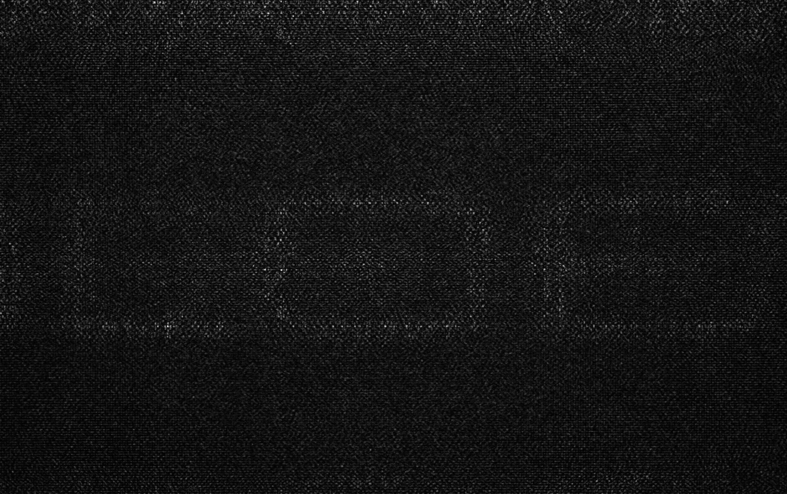

Example scripts results
-----------------------

On this page of the documentation we show images of results one can
expect to obtain when running the code
example provided with this repo.

In ``examples`` are various example scripts that showcase the main features
of this repository.

First, activate the virtual environment:

.. code-block:: sh

   source mask_designer_env/bin/activate

You can exit the virtual environment by running ``deactivate``.

Lens examples
^^^^^^^^^^^^^

.. code-block:: sh

   python examples/lens/run_gs.py

.. image:: images/res_lens_gs_2.png
   :target: images/res_lens_gs_2.png
   :align: center
   :alt: Lens GS 2

.. code-block:: sh
   
   python examples/lens/run_holoeye.py

.. image:: images/res_lens_holoeye_1.png
   :target: images/res_lens_holoeye_1.png
   :align: center
   :alt: Lens Holoeye 1

.. code-block:: sh
   
   python examples/lens/run_sgd_citl.py

.. image:: images/res_citl_phy_calib.png
   :target: images/res_citl_phy_calib.png
   :align: center
   :alt: Lens SGD CITL

.. image:: images/res_citl_sim_after.png
   :target: images/res_citl_sim_after.png
   :align: center
   :alt: Lens SGD CITL

.. image:: images/res_citl_phy_after.png
   :target: images/res_citl_phy_after.png
   :align: center
   :alt: Lens SGD CITL

.. code-block:: sh

  python examples/lens/run_sgd_citl.py
  Program mask onto the physical SLM.
  15:23:54.833989 Start imshow
  Program mask onto the physical SLM.
  15:23:58.315224 Start settle
  15:23:58.570841 End settle, start capture
  15:24:01.862928 End capture
  15:24:04.860459 End imshow
  15:24:05.442145 Start imshow
  Program mask onto the physical SLM.
  15:24:08.283236 Start settle
  15:24:08.536671 End settle, start capture
  15:24:11.972557 End capture
  15:24:15.478135 End imshow
     - Calibration failed
  15:24:16.298924 Start imshow
  Program mask onto the physical SLM.
  15:24:19.772224 Start settle
  15:24:20.023749 End settle, start capture
  15:24:20.350141 End capture
  15:24:26.692450 End imshow
  15:24:26.788523 Start imshow
  Program mask onto the physical SLM.
  15:24:30.325651 Start settle
  15:24:30.580847 End settle, start capture
  15:24:30.905616 End capture
  15:24:37.320012 End imshow
  Traceback (most recent call last):
    File "C:\Users\baehl\workspaces\mask-designer\examples\lens\run_sgd_citl.py", line 247, in <module>
      main()
    File "C:\Users\baehl\anaconda3\envs\mask-designer\lib\site-packages\click\core.py", line 1128, in __call__     
      return self.main(*args, **kwargs)
    File "C:\Users\baehl\anaconda3\envs\mask-designer\lib\site-packages\click\core.py", line 1053, in main
      rv = self.invoke(ctx)
    File "C:\Users\baehl\anaconda3\envs\mask-designer\lib\site-packages\click\core.py", line 1395, in invoke       
      return ctx.invoke(self.callback, **ctx.params)
    File "C:\Users\baehl\anaconda3\envs\mask-designer\lib\site-packages\click\core.py", line 754, in invoke        
      return __callback(*args, **kwargs)
    File "C:\Users\baehl\workspaces\mask-designer\examples\lens\run_sgd_citl.py", line 214, in main
      angles = sgd(target_amp, warm_start_phase).cpu().detach()
    File "C:\Users\baehl\anaconda3\envs\mask-designer\lib\site-packages\torch\nn\modules\module.py", line 1110, in _call_impl
      return forward_call(*input, **kwargs)
    File "C:\Users\baehl\workspaces\mask-designer\mask_designer\neural_holography\modules.py", line 229, in forward
  
      return stochastic_gradient_descent(
    File "C:\Users\baehl\workspaces\mask-designer\mask_designer\neural_holography\algorithms.py", line 338, in stochastic_gradient_descent
      raise ValueError("Gradient is None!")
  ValueError: Gradient is None!

.. code-block:: sh
   
   python examples/lens/run_sgd_waveprop.py

.. image:: images/res_lens_sgd_waveprop_1.png
   :target: images/res_lens_sgd_waveprop_1.png
   :align: center
   :alt: Lens SGD Waveprop 1

.. code-block:: sh
   
   python examples/lens/run_sgd.py

.. image:: images/res_lens_sgd_1.png
   :target: images/res_lens_sgd_1.png
   :align: center
   :alt: Lens SGD 1

Lensless examples
^^^^^^^^^^^^^^^^^

.. code-block:: sh
   
   python examples/lensless/run_gs.py

.. image:: images/res_lensless_gs_1.png
   :target: images/res_lensless_gs_1.png
   :align: center
   :alt: Lensless GS 1

.. image:: images/res_lensless_gs_2.png
   :target: images/res_lensless_gs_2.png
   :align: center
   :alt: Lensless GS 2

.. code-block:: sh

   python examples/lensless/run_holoeye.py
   
.. image:: images/res_lensless_holoeye_1.png
   :target: images/res_lensless_holoeye_1.png
   :align: center
   :alt: Lensless Holoeye 1

.. code-block:: sh
   
   python examples/lensless/run_sgd_waveprop.py

.. image:: images/res_lensless_sgd_waveprop_1.png
   :target: images/res_lensless_sgd_waveprop_1.png
   :align: center
   :alt: Lensless SGD Waveprop 1

.. image:: images/res_lensless_sgd_waveprop_2.png
   :target: images/res_lensless_sgd_waveprop_2.png
   :align: center
   :alt: Lensless SGD Waveprop 2

.. code-block:: sh
   
   python examples/lensless/run_sgd.py

.. image:: images/res_lensless_sgd_1.png
   :target: images/res_lensless_sgd_1.png
   :align: center
   :alt: Lensless SGD 1

Camera example
^^^^^^^^^^^^^^

.. code-block:: sh

   python examples/ids_image_capture.py

.. image:: images/res_cam_1.png
   :target: images/res_cam_1.png
   :align: center
   :alt: Cam 1

.. image:: images/res_cam_2.png
   :target: images/res_cam_2.png
   :align: center
   :alt: Cam 2

Aperture examples
^^^^^^^^^^^^^^^^^

.. code-block:: sh

   python examples/set_aperture.py

.. code-block:: sh

   python examples/plot_aperture.py

.. image:: images/res_set_1.png
   :target: images/res_set_1.png
   :align: center
   :alt: Set 1