Experimental setup
==================

Generally speaking there are two possibilities one can consider for the setup:
either one uses lenses or not. A lensless setup is interesting because of its
simplicity but it is also limited in the sense that the size of the resulting
interference patterns is only influenced by the size of the mask that is set on
the SLM. Hence one might end up using only a small part of the SLM depending on
the reproduction size of the amplitude pattern (photo sensors for example can be
small compared to the size of the SLM). When using lenses one can on the other
hand scale the pattern to an appropriate size (e.g. the size of the photo
sensor) but this comes at the cost of a more complex setup.

For the above reasons we decided to use a setup involving lenses but we also
provide code that allows to use a lensless setup. The setup is shown
schematically in the figure below.

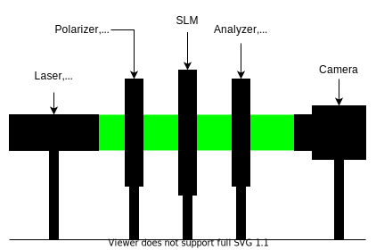

Final setup
-----------

Before going into the incremental steps that lead to the final setup we just
want to present the final version.

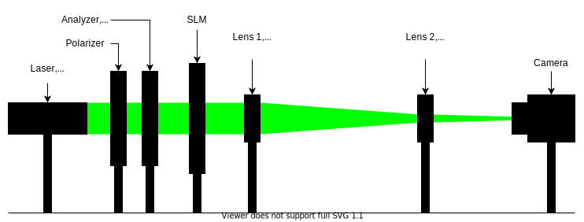

And here a picture taking of it in the lab.

.. image:: images/setup.jpg
   :target: images/setup.jpg
   :align: center
   :alt: Experimental setup

Focusing the optical system with the two lenses exactly on the photo sensor is a
bit tricky. By experience it is easiest to fix the convex lens and then moving
the concave lens and the camera in such a way that both scaling and focus are
good. Additionally, one can compute the exact focus plane of the lenses once you
found a configuration which is close to the scaling you are looking for.
Consider the following diagram.

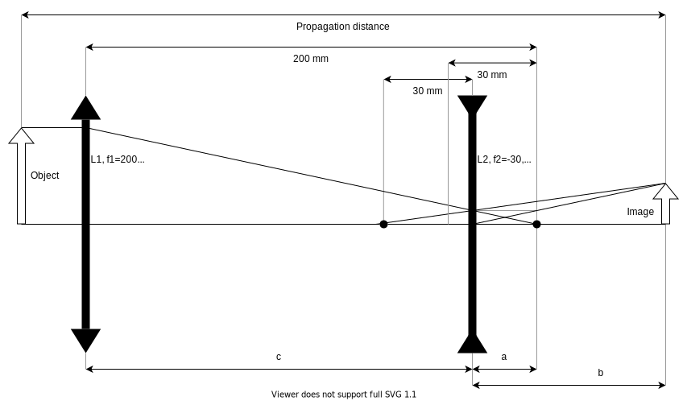

Hence, one can derive a formula for :math:`b`.

.. math::
   \begin{align}
   \frac{1}{-30}=\frac{1}{b}-\frac{1}{a} &\iff \frac{1}{b}=\frac{1}{a}-\frac{1}{30} \\
   &\iff b=\left(\frac{1}{a}-\frac{1}{30}\right)^{-1} \\
   &\iff b=\left(\frac{1}{200-c}-\frac{1}{30}\right)^{-1} \\
   \end{align}

with :math:`a=200-c` and :math:`170 < c < 200`.

Practical considerations
^^^^^^^^^^^^^^^^^^^^^^^^

Add current measurements

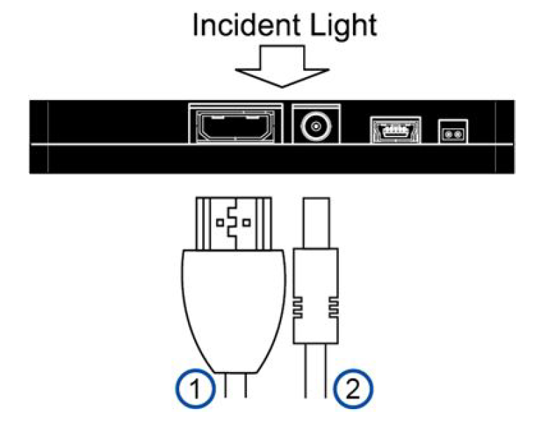

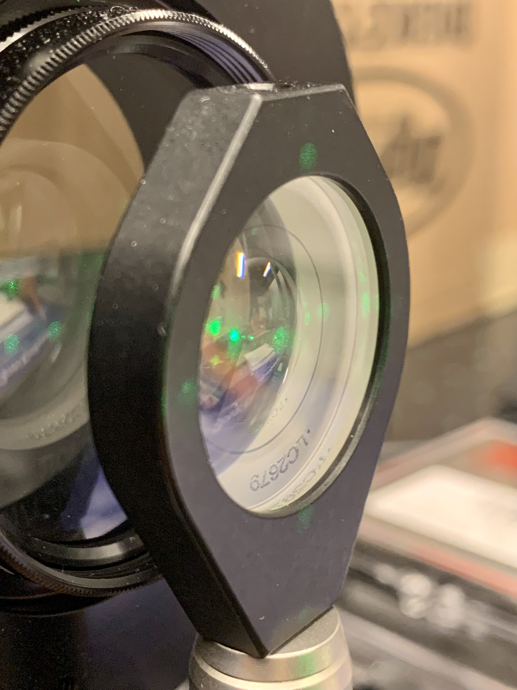

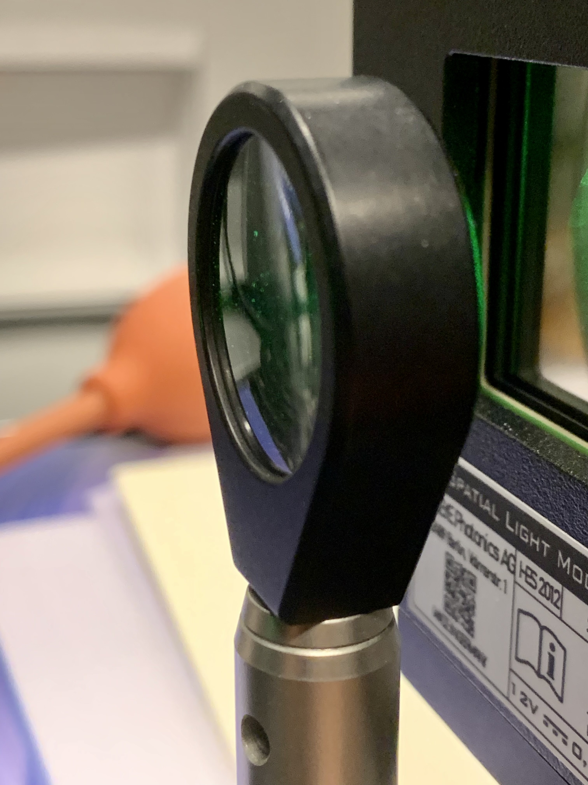

Incremental development of final setup
--------------------------------------

In this next section, we are going to walk through the different experimental
setups we tested to finally converge to the final setup. As a general rule we
found it to be way easier to use a camera with an exposed photo sensor i.e. with
no optics at all. Otherwise perfect alignment was tricky to achieve and all the
inconveniences of a bare bone senor could be resolved fairly easily. But you can
also use a simply screen instead of camera to avoid those complications.

Version 1
^^^^^^^^^

This setup was the simplest setup that was proposed in the ``OptiXplorer`` manual
that came with the Holoeye SLM. It's a starting point and conceived to built
upon. Note that both lenses and the SLM generally have a preferred orientation.
Additionally, for best results the laser beam should be collimated (all it's
rays should be parallel). The camera should be placed at the focal distance of
the convex lens.

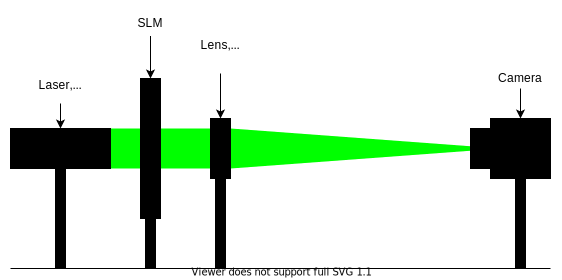

Version 2
^^^^^^^^^

In the same manual it is suggested to place the SLM after the lens because this
does not affect the resulting interference pattern but the
relative position of the SLM in between the lens and the camera changes the
scale of that pattern. Hence, by moving the the SLM closer to the camera the image size is
reduced and makes it easy to scale the size of the interference pattern to
perfectly match the photo sensor of the camera.

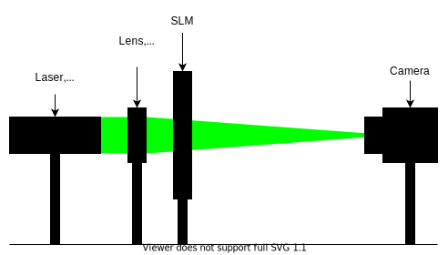

Version 3
^^^^^^^^^

Again, suggested by the manual, a polarizer (:math:`-45°`) and an analyzer (:math:`15°`) are
added to the very front and the very back of the optical pipeline respectively.
Those are the required settings according to Holoeye for the SLM to perform
optimally as a phase SLM.

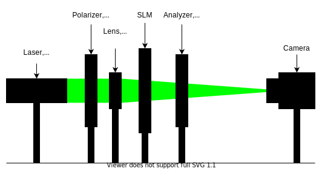

Version 4
^^^^^^^^^

A second lens, this time a concave one, is added to the optical setup which
allows to change the scaling of the interference pattern. The
relative position of the to lenses determines the scale (and the position of the
SLM).

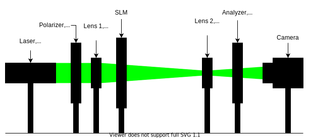

This setup was the final version suggested by Holoeye but we experienced
several issues and problems with it. Firstly, having the SLM after the first lens
creates a situation where the laser beam that enters the SLM actually is no
longer collimated which goes against what was suggested earlier. Visually it
seems to make not a big difference as the convex lens has a rather big focal
distance the beam is still close to being collimated. Nonetheless, it is cleaner
to put the SLM in front of any lens and handle the scaling of the interference
pattern differently. And adding the concave lens gave us another way of
manipulating the scale. Secondly, we experienced oversaturation of the photo sensor
even with the shortest exposure times possible with Thorlabs software
(`ThorCam <https://www.thorlabs.com/software_pages/ViewSoftwarePage.cfm?Code=ThorCam>`_)
that natively comes with the camera. A handy
way of controlling the
amount of light, i.e. its intensity, is to use two polarizers back to back and
turning them relative to each other such that just the right amount of light
passes through them. Instead of adding a third polarizer we simply moved the analyzer
in between the polarizer and the SLM. The removal of the analyzer did not
visually degrade the results. But it would be cleaner to follow Holoeye
suggestions here.

Version 5
^^^^^^^^^

For simplicity, we first only used one lens to test if our changes to the setup
where a step in the right direction. And indeed they where. Note that in order
to stay as close to Holoeye's setup the input polarization of the light
hitting the SLM was not changed. We no longer had any
issues with the light intensity as the back to back polarizers provide an
efficient way of controlling the light intensity parameter. But, as expected, the resulting
pattern was pretty small and hence we needed to address the scaling issue.

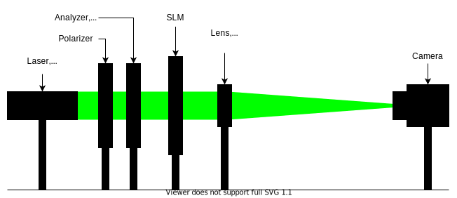

Version 6
^^^^^^^^^

Adding the concave lens back into the setup solved the scaling issue.

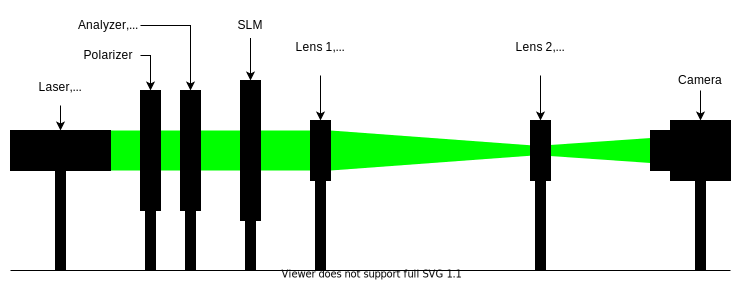

Final setup
^^^^^^^^^^^

As mentioned earlier, removing the analyzer and using it in the back to back
polarizer pair didn't harm the visual results but still is not what was suggested
by Holoeye. Hence, either we should use 3 polarizers or find another solutions.
Luckily, testing other software that allows to control the camera (`IDS
Peak <https://en.ids-imaging.com/download-details/AB00695.html>`_) enabled even
lower exposure times. So low that the intensity of the laser beam did not
oversaturate the photo sensor, even without the back to back polarizer pair
anymore. Hence, we could use the two polarizers as intended by
Holoeye, leading to the final setup.

