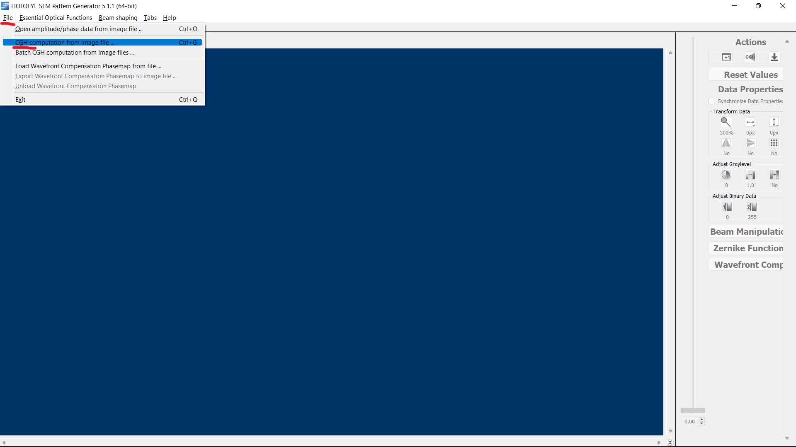
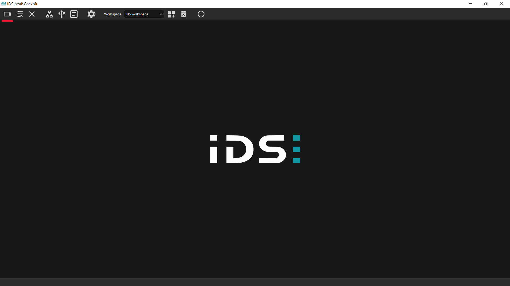
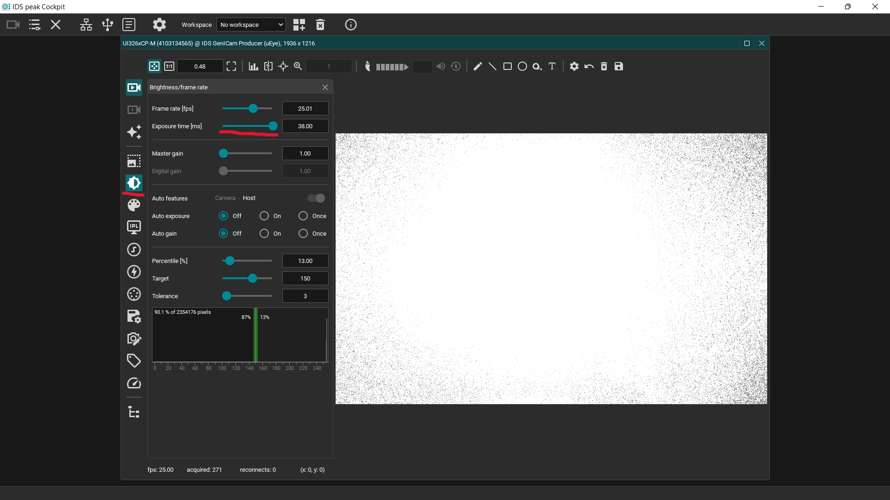
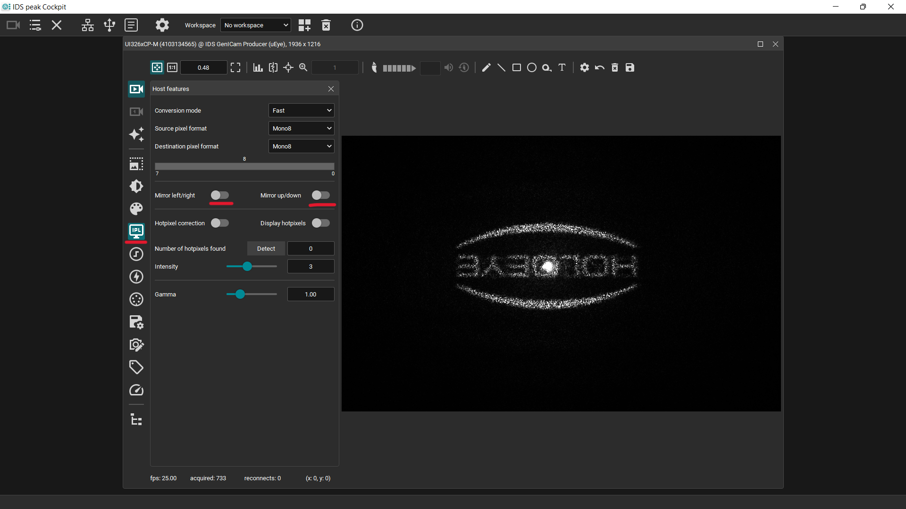

Software tips
==================

This page is intended to give some useful tips and tricks for using 3rd party
software than comes in handy when using ``mask-designer``.

Holoeye SLM Pattern Generator
-----------------------------

This piece of software allows to compute phase masks and export them. By
clicking on ``File -> CGH computation from image file ...`` you can load a
target amplitude in form of an image.

We recommend to use a scaling factor of :math:`1`. Optionally, you can also tick to box
to show a preview of the simulated results of the propagation of the computed
phase mask. This feature seems very limited though, merely returning the initial
target phase mask.

.. image:: images/pattern_gen_2.png
   :target: images/pattern_gen_2.png
   :align: center
   :alt: Pattern generator 2

The green tab is indicating that the pattern is currently programmed onto the
Holoeye SLM. In the case you should have opened different phase masks, multiple
tabs will be opened, each in a different tab. By clicking on them the green
color will show which one is currently programmed. The ``Save`` button allows to
export the phase mask to a file and to subsequently use it in ``mask-designer``.

.. image:: images/pattern_gen_3.png
   :target: images/pattern_gen_3.png
   :align: center
   :alt: Pattern generator 3

IDS Peak Cockpit
----------------

This piece of software is a GUI application that interfaces with the Thorlab
camera (just a rebranded IDS camera). First, open the list of connected cameras
which should show the Thorlab camera if the installation was successful.

In the adequate menu, you can adapt the exposure time.

In an another one, you can flip the capture along both x- and y-axis.

Finally, you can save the current image to a file.

.. image:: images/ids_4.png
   :target: images/ids_4.png
   :align: center
   :alt: IDS 4
