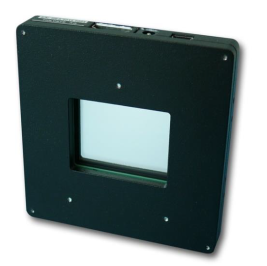
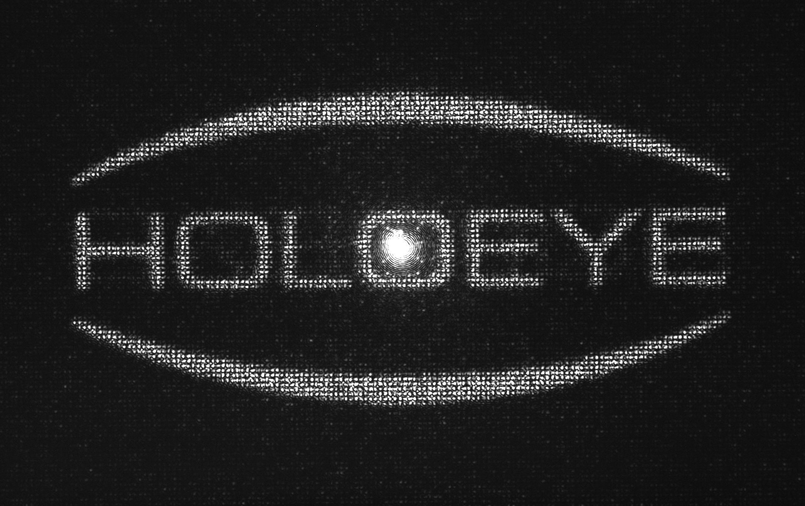
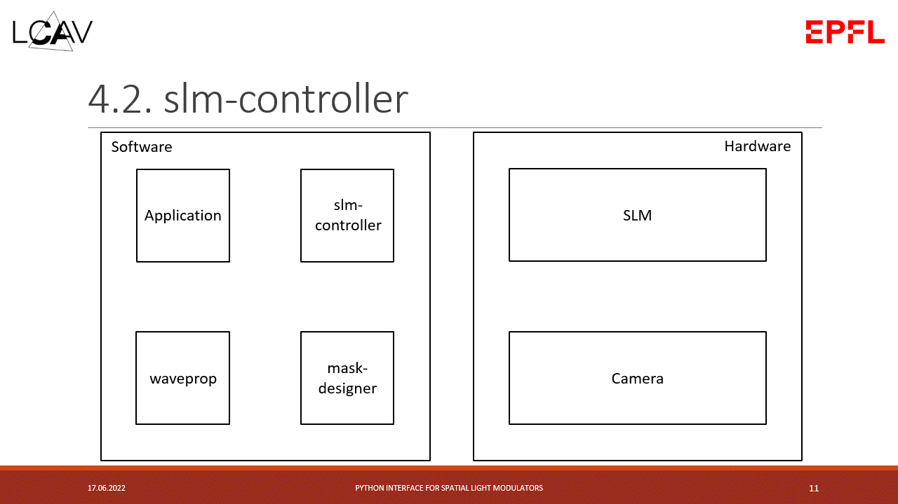
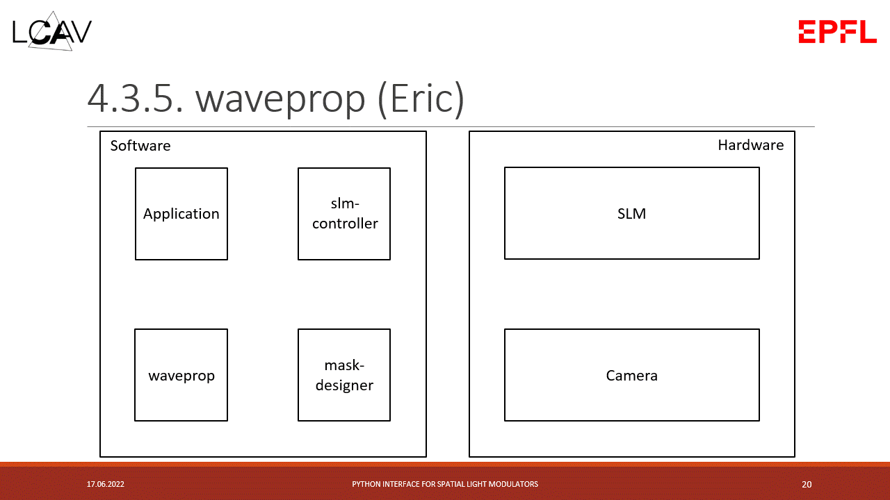

Theory
======

.. contents:: Table of Contents
   :depth: 5
   :local:
.. :backlinks: none

Overview
--------

More as a reminder and complementary to the ``README.rst``, we are quickly going over
the main goals and concepts used in this package.

SLMs
^^^^

Spatial Light Modulators (SLMs) are devices that modulate properties of light,
either its amplitude, phase or polarization in space or time and can be reflective or transmissive.
Here an example of a SLM we support (via `slm-controller <https://github.com/ebezzam/slm-controller>`_) in this project, the `Holoeye LC
2012 <https://holoeye.com/lc-2012-spatial-light-modulator/>`_.

   **Image Credit** [1]_

It's a transmissive SLM and allows to modulate both amplitude and phase.
Commonly SLMs, and also the Holoeye one, are based on Liquid Crystal Display
(LCD) technology. Briefly, the SLM consists of a grid of crystal cells where
each of them can be programmatically addressed and by applying
different voltages its physical properties are changed. Concretely, for the
Holoeye SLM Twisted Nematic (TN) cells are used. Here two image that sum
this up:

.. figure:: images/tn_lc_ground_state.png
   :target: images/tn_lc_ground_state.png
   :align: center
   :alt: Holoeye slm

   **Image Credit** [1]_

This picture shows such a TN cell when no voltage is applied. The polarization
of the light follows the crystal molecules and is hence rotated by :math:`90°`.

.. figure:: images/tn_lc.png
   :target: images/tn_lc.png
   :align: center
   :alt: Holoeye slm

   **Image Credit** [1]_

When a voltage is applied the twist in the helix is altered leading to different
properties. More precisely, :math:`V_A = 0` with
twisted, but untilted molecules, :math:`V_B > V_{thr}` with tilted, partially
aligned molecules, :math:`V_C \gg V_{thr}` with aligned molecules in the central region
of the cell.

By modulating the polarization and combining the SLM with a polarizer and an
analyzer both amplitude and phase modulation can be achieved.

SLMs generally have different fields of application like, for example, Lensless
Imaging but in this project the focus lies on Computer Generated Holography (CGH).
In this domain the goals is to produce interesting interference patterns of
light waves, like images etc. Generally, it's a hard problem to prepare such
holographic light waves that then can be transported to an observer leading to
the expected output. Nonetheless, it can be done using fixed masks but it's way
more interesting to use SLMs for this task, being programmatically
changeable. Next, we are going to focus on how to prepare such holographic light
waves using SLMs to modulate the lights phase, more precisely on how to compute
the mask that needs to be put
on those devices. This problem is commonly called phase retrieval.

Phase retrieval
^^^^^^^^^^^^^^^

.. TODO only phase slms?

This package is intended to provide different approaches to the inverse problem called phase
retrieval, i.e. mask design for phase SLMs. So concretely, those algorithms aim to
compute a phase mask that can be set on a SLM such that a given target image is
appearing on the screen ofter propagation of the light waves. For example, we
want to get this target amplitude.

.. figure:: ../../images/target_amplitude/holoeye_logo.png
   :target: ../../images/target_amplitude/holoeye_logo.png
   :align: center
   :alt: Holoeye logo

   **Image Credit** [2]_

Any of those algorithms then computes the corresponding phase map.

.. image:: ../../images/phase_mask/holoeye_logo.png
   :target: ../../images/phase_mask/holoeye_logo.png
   :align: center
   :alt: Holoeye logo phase

And finally, this phase mask can be sent to a SLM and propagated to the target
plane where one can observe the resulting image.

To interact and control such SLM devices this package depends on a different
package `slm-controller <https://github.com/ebezzam/slm-controller>`_ which is
developed jointly with this package.

For most of these phase retrieval algorithms light propagation simulation plays
an essential role. That is, simulating light waves with given phase
values propagating to the target plane and predicting the resulting amplitudes.
For now those simulations are not performed with our in house package
`waveprop <https://github.com/ebezzam/waveprop>`_ but it is our goal to use it
throughout the code.

The mask-designer includes more features but mask designing is the main problem
it tackles. The different strategies are more or less directly imported from `GitHub <https://github.com/computational-imaging/neural-holography>`_. As
shown in the
`paper <https://www.computationalimaging.org/wp-content/uploads/2020/08/NeuralHolography_SIGAsia2020.pdf>`_
that goes with the repository, a ``Camera-In-The-Loop`` (CITL) approach leads to the best
results. This technique includes capturing images of the resulting amplitudes at
the target plane and using this information to improve the phase map
iteratively. But these approaches are explained in more depth in the `Neural
Holography <#neural-holography>`_ section. For CITL though, interaction with
a camera is needed which this package provides an interface for.

Overall the following schematic shows the interactions between the different
software and hardware modules that normal use cases would produce.

.. image:: images/structure.svg
   :target: images/structure.svg
   :align: center
   :alt: Structure

The interactions marked with *CITL* are only necessary for the CITL approach.
More details are given in the `Typical interactions between software and hardware <#typical-interactions-between-software-and-hardware>`_ section.

Holoeye SLM Pattern Generator
-----------------------------

Holoeye does also provide a piece of software called `SLM Pattern
Generator <https://customers.holoeye.com/slm-pattern-generator-v5-1-1-windows/>`_
which amongst others has a feature that does perform phase retrieval for a given
target amplitude. One such example can be found in ``images/holoeye_phase_mask``
and its corresponding amplitude at the target plane under
``images/target_amplitude``.

This code is unfortunately not open-source but they claim to use an Iterative
Fourier Transform Algorithm (IFTA) summed up in the following diagram.

.. figure:: images/holoeye_algo.png
   :target: images/holoeye_algo.png
   :align: center
   :alt: Holoeye algorithm

   **Image Credit** [3]_

The Discrete Fourier Transform (DFT) here does perform propagation simulation in
the `Fraunhofer <https://en.wikipedia.org/wiki/Fraunhofer_diffraction_equation>`_
sense. All in all, the IFTA is probably the easiest approach to phase retrieval,
iteratively enforcing constraints (as being close to the target amplitude on the
target plane) and propagating back and forth (i.e.
simulating the wave propagation). Neural Holography does implement the
Gerchberg-Saxton algorithm which is basically the same.

Neural Holography
-----------------

The authors of ``Neural Holography`` (`paper <https://www.computationalimaging.org/wp-content/uploads/2020/08/NeuralHolography_SIGAsia2020.pdf>`_ &
`repository <https://github.com/computational-imaging/neural-holography>`_)
provide implementations to different phase retrieval approaches. Here a
list of the methods that were slightly modified and hence are now compatible
with the remainder of the project:

#. Gerchberg-Saxton (GS)
#. Stochastic Gradient Descent (SGD)
#. Camera-In-The-Loop (CITL)

1. Gerchberg-Saxton (GS)
^^^^^^^^^^^^^^^^^^^^^^^^

As mentioned earlier, this is basically the IFTA. Light is iteratively
propagated back and forth and constraints are enforced at both ends, like being
close to the target amplitude at the target plane.

2. Stochastic Gradient Descent (SGD)
^^^^^^^^^^^^^^^^^^^^^^^^^^^^^^^^^^^^

Similar to before, the phase mask is iteratively optimized such that the
resulting amplitude after propagation is closer and
closer to the target amplitude. Note that this methods requires the light
propagation to be differentiable. Additionally, this method uses a region of
interest (ROI) in which errors are more penalized than on the outside of this
region. So typically you want the result to be close to the target in the center
but give the
algorithm some slack in the border regions. This simplifies the optimization
task as you do not force the algorithm to optimize regions which you do not care
about. Generally speaking, you require fewer iterations and hence get some speedup.

3. Camera-In-The-Loop (CITL)
^^^^^^^^^^^^^^^^^^^^^^^^^^^^

CITL adds physical propagation and the measurement of those results into the
game. The idea is to compute a phase mask (for example with SGD), propagate
it physically using a SLM, then measuring the resulting amplitudes on the target
plane using a camera and finally using those observations to improve the phase
map further before repeating these steps. So this approach is iterative.
Additionally, it is technically the most challenging one. But as shown in the Neural
Holography paper it performs better than all the other methods. At the current
state of the project. the training of the CITL is functional but more work needs to be done in
order to make it truly useable and testable.

Typical interactions between software and hardware
--------------------------------------------------

The following gif-files illustrate the interactions between software and hardware
components that arise normally in typical use cases.

Set a mask using ``slm-controller``
^^^^^^^^^^^^^^^^^^^^^^^^^^^^^^^^^^^^^^^

Perform phase retrieval (without CITL)
^^^^^^^^^^^^^^^^^^^^^^^^^^^^^^^^^^^^^^

.. image:: gifs/neural-holo.gif
   :target: gifs/neural-holo.gif
   :align: center
   :alt: Schematic representation of the interactions between different components

Perform phase retrieval using CITL
^^^^^^^^^^^^^^^^^^^^^^^^^^^^^^^^^^

.. image:: gifs/citl.gif
   :target: gifs/citl.gif
   :align: center
   :alt: Schematic representation of the interactions between different components

Perform phase retrieval using CITL and ``waveprop`` for simulation
^^^^^^^^^^^^^^^^^^^^^^^^^^^^^^^^^^^^^^^^^^^^^^^^^^^^^^^^^^^^^^^^^^^^^^

Propagation
-----------

Following Holoeye's manual, those setup all include one convex lens.
Neural Holography on the other hand, uses a different setting where no lens is
placed between the SLM and the target plane, i.e. a lensless setting (at least
in the first part of their optical configuration).

.. figure:: images/neural_holography_setup.png
   :target: images/neural_holography_setup.png
   :align: center
   :alt: Neural Holography experimental setup

   **Image Credit** [4]_

A convex lens is physically performing a Fourier transform, hence those settings
are not compatible with each other, meaning that a phase mask computed using
Neural Holography code won't result in the desired amplitudes on the photo sensor
and vice versa for the same target amplitude.

Hence, our physical setup does perform propagation in the
`Fraunhofer <https://en.wikipedia.org/wiki/Fraunhofer_diffraction_equation>`_
sense, where the propagation basically boils down to applying a Fourier
transform. This fact was confirmed by simulating propagation using Fraunhofer of phase maps
generated by Holoeye software and comparing the results to physical observations
with our experimental setup (including one convex lens).

Additionally, Neural Holography uses a different propagation method, namely `Angular spectrum
method <https://en.wikipedia.org/wiki/Angular_spectrum_method>`_ (ASM). To
summarize, we have those differences in propagation:

.. TODO above, we propagate the field not only the phase mask

Thus for the ``same target amplitude`` we obtain ``different phase maps`` where the
difference is not explained with numerical variations.

Mathematically, we have that

.. math::
   \begin{align}
   A &\approx (FT \circ S)(\phi_H) := p_H(\phi_H) \\
   A &\approx (IS \circ FT \circ S \circ M \circ IFT \circ S)(\phi_N) := p_N(\phi_N) \\
   \end{align}

but :math:`\phi_H \neq \phi_N` and where

* :math:`A` is the amplitude at the target plane of the propagated light,
* :math:`\approx` expresses the fact that those methods results in the "same" amplitudes up to some numerical errors,
* :math:`\phi_H` is the phase mask computed using Holoeye software,
* :math:`\phi_N` is the phase mask computed using Neural Holography code,
* :math:`FT` is a regular Fourier transform,
* :math:`IFT` its inverse transform,
* :math:`S` simply shifts i.e. rotates part of the Tensors,
* :math:`IS` does the inverse shift and
* :math:`M` is a matrix multiplication by the homography matrix :math:`H` computed internally.

In order to be able to use the Neural Holography code (same goes
the other way around) we need to be able to transform the phase maps. We get

.. math::
   \begin{align}
   \phi_N&=(IS \circ FT \circ S \circ M \circ IFT \circ IFT)(\phi_H) := t_{H \rightarrow N}(\phi_H) \\
   \phi_H&=(FT \circ FT \circ S \circ M^{-1} \circ IFT \circ S)(\phi_N) := t_{N\rightarrow H}(\phi_H) \\
   \end{align}

and hence we have that

.. math::
   \begin{align}
   A &\approx p_H(\phi_H)=(p_H \circ t_{N\rightarrow H})(\phi_N) \\
   A &\approx p_N(\phi_N)=(p_N \circ t_{H\rightarrow N})(\phi_H) \\
   \end{align}

as desired. In diagrammatic form we have the following situation:

Both these transformations are implemented in
``mask_designer/transform_fields.py``. Note that the wrapper
``mask_designer/wrapper.py`` provides interfacing methods for Neural Holography phase retrieval
algorithms that also handle the transformation to our setup which includes a
convex lens.

References
----------

.. [1] Holoeye OptiXplorer Manual
.. [2] Holoeye OptiXplorer Software
.. [3] Frank Wyrowski and Olof Bryngdahl, "Iterative Fourier transform algorithm
  applied to computer holography," J. Opt. Soc. Am. A 5, 1058-1065 (1988)
.. [4] Peng, Yifan & Choi, Suyeon & Padmanaban, Nitish & Wetzstein, Gordon. (2020).
  Neural holography with camera in the loop training. ACM Transactions on
  Graphics. 39. 1-14. 10.1145/3414685.3417802.
