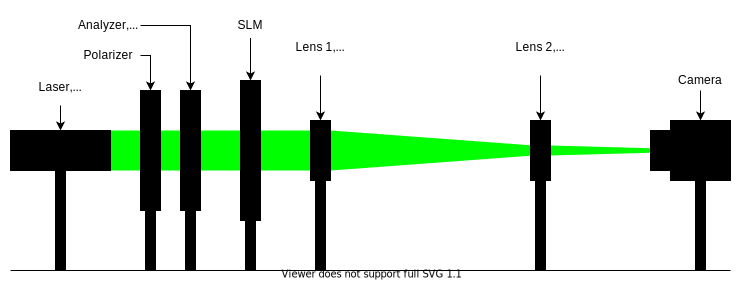

# Documentation

- [Documentation](#documentation)
  - [Overview](#overview)
    - [SLMs](#slms)
    - [Phase retrieval](#phase-retrieval)
  - [Holoeye SLM Pattern Generator](#holoeye-slm-pattern-generator)
  - [Neural Holography](#neural-holography)
  - [Experimental setup](#experimental-setup)
    - [Setup 1](#setup-1)
    - [Setup 2](#setup-2)
    - [Setup 3](#setup-3)
    - [Setup 4](#setup-4)
    - [Setup 5](#setup-5)
    - [Final setup](#final-setup)
  - [Propagation](#propagation)
  - [Sources](#sources)

## Overview

More as a reminder and complementary to the `README.md`, we are quickly going over
the main goals and concepts used in this package.

### SLMs

Spatial Light Modulators (SLMs) are devices that modulate properties of light,
either its amplitude, phase or polarization in space or time and can be reflective or transmissive.
Here a example of a SLM we support (via [slm-controller](https://github.com/ebezzam/slm-controller)) in this project, the [Holoeye LC
2012](https://holoeye.com/lc-2012-spatial-light-modulator/).

It's a transmissive SLM and allows to modulate both amplitude and phase. Commonly SLMs and also the Holoeye one are based
Liquid Crystal Display (LCD) technology. Briefly, the SLM consists of a grid of
such crystal cells where each of them can be programmatically addressed and by applying
different voltages its physical properties are changed. Concretely, for the
Holoeye SLM Twisted Nematic (TN) cells are used. Here two image that sum
this up:

This picture shows such a TN cell when no voltage is applied. The polarization
of the light follows the crystals and is hence rotated by $90°$.

When a voltage is applied the twist in the helix is altered leading to different
properties. Here, $V_A = 0$ with
twisted, but untilted molecules, $V_B > V_{thr}$ with tilted, partially
aligned molecules, $V_C >> V_{thr}$ with aligned molecules in the central region
of the cell.

By modulating the polarization and combining the SLM with a polarizer and an
analyzer amplitude and phase modulation can be achieved.

SLMs generally have different fields of application like, for example, lensless
imaging but in this project the focus lies on Computer Generated Holography (CGH).
In this domain the goals is to produce interesting interference patterns of
light wave, like images etc. Generally, it's a hard problem to prepare such
holographic light waves that then can be transported to an observer leading to
the expected output. Nonetheless, it can be done using fixed masks but it's way
more interesting to use SLMs for this task, being programmatically
changeable. Next, we are going to focus on how to prepare such holographic light
waves using SLMs to modulate the lights phase, more precisely on how to compute
the mask that needs to be put
on those devices. This problem is commonly called phase retrieval.

### Phase retrieval

<!-- TODO only phase slms? -->

This package is intended to provide different approaches to the inverse problem of phase
retrieval, i.e. mask design for phase SLMs. So concretely, those algorithms aim to
compute a phase map that can be set on a SLM such that a given target image is
appearing on the screen. For example, we want to get this target amplitude.

Any of those algorithms then computes the corresponding phase map.

And finally, this phase map can be sent to a SLM and propagated to the target
plane where one can observe the resulting image.

To interact and control such SLM device this package depends on a different
package [slm-controller](https://github.com/ebezzam/slm-controller) which is
developed jointly with this package.

For most of these phase retrieval algorithms light propagation simulation plays
an essential role. That is, simulating light with the given phase
values propagating to the target plane and predicting the resulting amplitude
pattern. For now those simulations are not performed with our in house package
[waveprop](https://github.com/ebezzam/waveprop) but it is our goal to use it
throughout the code base.

The slm-designer includes more features but mask designing is the main problem
it tackles. The different strategies are more or less directly imported from [Neural
Holography](https://github.com/computational-imaging/neural-holography). As
shown in the
[paper](https://www.computationalimaging.org/wp-content/uploads/2020/08/NeuralHolography_SIGAsia2020.pdf)
that goes with the code, a `Camera-In-The-Loop` (CITL) approach leads to the best
results. This technique includes capturing images of the resulting amplitudes at
the target plane and using this information to improve the phase map
iteratively. But these approaches are explained in more depth in the [Neural
Holography](#neural-holography) section. For CITL though, interaction with
a camera is needed which this package provides an interface for.

Overall the following schematic shows the interactions between the different
software and hardware modules that normal use cases would produce.

## Holoeye SLM Pattern Generator

Holoeye does also provide a piece of software called [SLM Pattern
Generator](https://customers.holoeye.com/slm-pattern-generator-v5-1-1-windows/)
which amongst others has a feature that does perform phase retrieval for a given
target amplitude. One such example can be found in `images/holoeye_phase_map`
and its corresponding amplitude at the target plane under
`images/target_amplitude`.

This code is unfortunately not open-source but they claim to use an Iterative
Fourier Transform Algorithm (IFTA) summed in the following picture.

The Discrete Fourier Transform (DFT) here does perform propagation simulation in
the [Fraunhofer](https://en.wikipedia.org/wiki/Fraunhofer_diffraction_equation)
sense. All in all, the IFTA is probably the easiest approach to phase retrieval,
iteratively enforcing constraints (as being close to the target amplitude on the
target plane) and propagating back and forth (i. e.
simulating the wave propagation). Neural Holography does implement the
Gerchberg-Saxton algorithm which is basically the same.

## Neural Holography

The authors of `Neural Holography` ([paper](https://www.computationalimaging.org/wp-content/uploads/2020/08/NeuralHolography_SIGAsia2020.pdf) &
[repository](https://github.com/computational-imaging/neural-holography))
provide implementations to different phase retrieval approaches. Here a
list of the methods that were slightly modified and hence compatible
with the remainder of the project and where to find them:

- Gerchberg-Saxton (GS)
- Stochastic Gradient Descent (SGD)
- Double Phase Amplitude Coding (DPAC)
- Camera-In-The-Loop (CITL)

## Experimental setup

In this next section, we are going to walk through the different experimental
setups we tested to finally converge to a final setup. As a general rule we
found it to be way easier to use a camera with an exposed photo sensor i.e. with
no optics at all. Otherwise perfect alignment was tricky and all the
inconveniences of a bare bone senor could be resolved fairly easily. But you can
also use a simply screen instead of camera to avoid those complications.

### Setup 1

This setup was the simplest setup that was proposed in the `OptiXplorer` manual
that came with the Holoeye SLM. It's a starting point and conceived to built
upon. Note that both lenses and the SLM generally have a preferred orientation.
Additionally, for best results the laser beam should be collimated (all it's
rays should be parallel). The camera should be placed at the focal distance of
the convex lens.

### Setup 2

In the same manual it is suggested to place the SLM after the lens because this
those not affect the resulting interference pattern but the
relative position of the SLM in between the lens and the camera only changes the
scale of that pattern. Hence, by moving the the SLM closer to the camera the image size is
reduced and makes it easy to scale the size of the interference pattern to
perfectly match the photo sensor of the camera.

### Setup 3

Again, suggested by the manual, a polarizer ($-45°$) and an analyzer ($15°$) are
added to the very front and the very back of the optical pipeline respectively.
Those are the required settings according to Holoeye for the SLM to perform
optimally as a phase SLM.

### Setup 4

A second lens, this time a concave one is added to the optical setup which
allows to change the size, the scaling, of the interference pattern. The
relative position of the to lenses determines the scale.

This setup was the final version suggested by the Holoeye but we experienced
several issues and problems with it.

### Setup 5

### Final setup

$$
\begin{align}
 \frac{1}{−75}=\frac{1}{b}−\frac{1}{a} &\iff \frac{1}{b}=\frac{1}{a}−\frac{1}{75} \\
 &\iff b=\left(\frac{1}{a}−\frac{1}{75}\right)^{−1} \\
 &\iff b=\left(\frac{1}{200−c}−\frac{1}{75}\right)^{−1}
\end{align}
$$

with $a=200−c$ and $125 < c < 200$.

## Propagation

This software assumes a experimental setup that uses a lens in between the SLM and
the target plane. Neural Holography on the other hand, uses a different setting
where no lens is placed between the SLM and the target plane, i.e. a lensless
setting. Those differences impact the resulting phase map of the mask design
algorithm. The methods in `slm_designer/transform_fields.py` allow transforming phase maps,
fields, back and forth between both settings. Note that Neural Holography encodes
phase maps, images etc. as 4D PyTorch Tensors where the dimensions are [image,
channel, height, width]. But again, the wrapper `slm_designer/wrapper.py` does
provide interfacing methods for the different algorithms that handle all those complications for you and you
are not required to dig any deeper than that.

$$
\begin{align}
A_h&=(FT \circ S)(\phi_h) \\
A_n&=(IS \circ FT \circ S \circ M \circ IFT \circ S)(\phi_n) \\
\phi_n&=(IS \circ FT \circ S \circ M \circ IFT \circ IFT)(\phi_h) \\
\phi_h&=(FT \circ FT \circ S \circ M^{-1} \circ IFT \circ S)(\phi_n) \\
\end{align}
$$

where $FT$ is a regular Fourier transform, $IFT$ its inverse transform,
$S$ simply shifts i.e. rotates part of the Tensors, $IS$ does the inverse shift
and $M$ is a matrix multiplication by the homography matrix $H$ computed internally.

## Sources

- Holoeye OptiXplorer Manual
- Frank Wyrowski and Olof Bryngdahl, "Iterative Fourier transform algorithm
  applied to computer holography," J. Opt. Soc. Am. A 5, 1058-1065 (1988)
- Peng, Yifan & Choi, Suyeon & Padmanaban, Nitish & Wetzstein, Gordon. (2020).
  Neural holography with camera in the loop training. ACM Transactions on
  Graphics. 39. 1-14. 10.1145/3414685.3417802.
