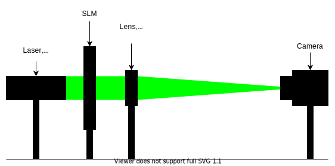
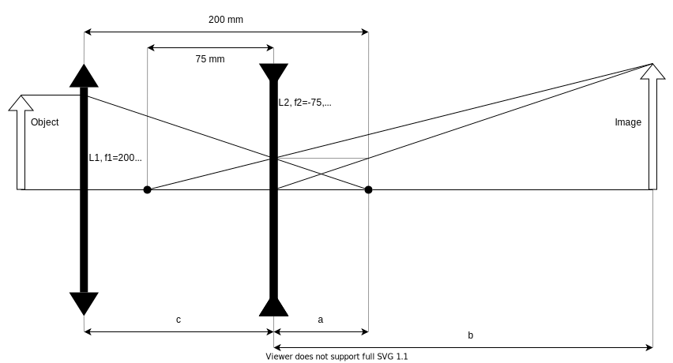

# Documentation

- [Documentation](#documentation)
  - [Overview](#overview)
  - [Experimental setup](#experimental-setup)
  - [Propagation](#propagation)

## Overview

## Experimental setup

$$
\begin{align}
 \frac{1}{−75}=\frac{1}{b}−\frac{1}{a} &\iff \frac{1}{b}=\frac{1}{a}−\frac{1}{75} \\
 &\iff b=\left(\frac{1}{a}−\frac{1}{75}\right)^{−1} \\
 &\iff b=\left(\frac{1}{200−c}−\frac{1}{75}\right)^{−1}
\end{align}
$$

with $a=200−c$ and $125 < c < 200$.

## Propagation

$$
\begin{align}
A_h&=(FT \circ S)(\phi_h) \\
A_n&=(IS \circ FT \circ S \circ M \circ IFT \circ S)(\phi_n) \\
\phi_n&=(IS \circ FT \circ S \circ M \circ IFT \circ IFT)(\phi_h) \\
\phi_h&=(FT \circ FT \circ S \circ M^{-1} \circ IFT \circ S)(\phi_n) \\
\end{align}
$$

where $FT$ is a regular Fourier transform, $IFT$ its inverse transform,
$S$ simply shifts i.e. rotates part of the Tensors, $IS$ does the inverse shift
and $M$ is a matrix multiplication by the homography matrix $H$ computed internally.
