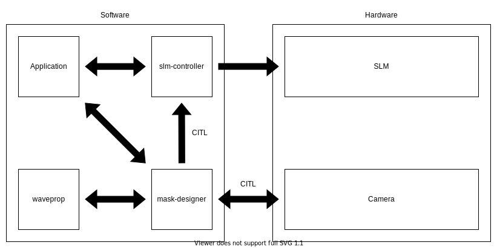
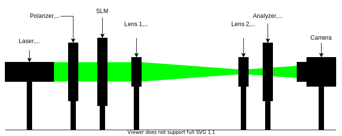
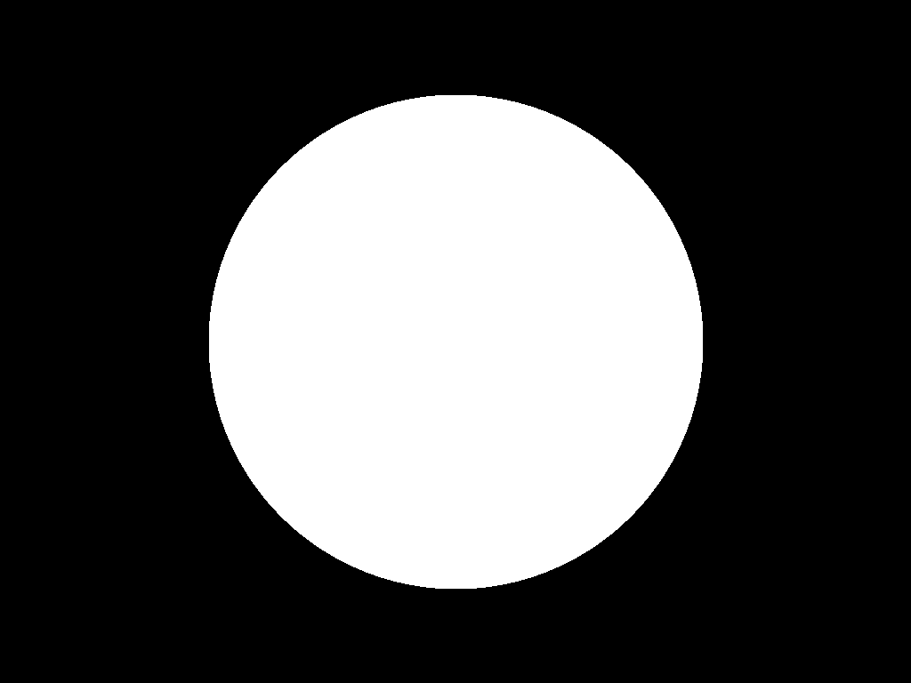

mask-designer
=============

.. image:: https://readthedocs.org/projects/mask-designer/badge/?version=latest
   :target: https://mask-designer.readthedocs.io/en/latest/?badge=latest
   :alt: Documentation Status

Collection of techniques to design mask patterns, e.g. fixed apertures for
amplitude masks and perform phase retrieval for determining a phase mask under an
incoherent light source.

.. contents:: Table of Contents
   :depth: 5
   :local:

------------------------

The main goal of the repository is to tackle the inverse problem of phase retrieval,
i.e. mask design for SLMs.
But it also allows to explore the forward problem by setting a phase
mask and then simply observing the output amplitude at the target plane.
Mainly though, it consists of mask design techniques that were introduced in the `Neural
Holography <https://www.computationalimaging.org/publications/neuralholography/>`_
work by Prof. Gordon Wetzstein's group at Stanford, and adapted to be compliant
with the SLM of this project - the `Holoeye LC
2012 <https://holoeye.com/lc-2012-spatial-light-modulator/>`_. Further, another
section of the code does add support for cameras. Neural Holography, among
other things, follows a **Camera-In-The-Loop** approach which involves a
camera taking pictures of the resulting interference patterns at the target
plane and then using this information to improve the designed mask iteratively.
Finally, utility functions are provided so that masks designed by Holoeye's
(closed-source) software or Neural Holography's code can be used
interchangeably for different setups (as Holoeye and Neural Holography assume
different physical setups).

Below is a schematic of how ``mask-designer`` would typically interact with
other software and hardware components.



The interactions marked with *CITL* are only necessary for the CITL approach.
You can find animated gif-files showing those interactions in more details in
the documentation.

Documentation
-------------

If you wish to learn more about the theory behind this repository, the evolution
of our experimental setup, etc. please refer to the documentation hosted on
readthedocs at `mask-designer <https://mask-designer.readthedocs.io/en/latest/>`_.

Installation
------------

To install, simply run the following script:

.. code-block:: sh

   ./env_setup.sh

The script will:


#. Create a Python3 virtual environment called ``mask_designer_env``.
#. Install Python dependencies in the virtual environment.
#. Install `slm-controller <https://github.com/ebezzam/slm-controller>`_ in setuptools “development mode”
   from GitHub directly.
#. Install `waveprop <https://pypi.org/project/waveprop/>`_ from PyPI.

This project is using those two repositories to program SLMs after the
phase mask has been computed and to simulate the light propagation which is
needed for different
phase retrieval algorithms or propagation simulations. Note that those are still
in development too.

.. note::
   The phase SLM implemented inside the ``slm-controller`` is actually only supported
   on **Windows**. Holoeye does only provide an SDK for this OS which is used by the controller to
   interface with the SLM.

If you plan to use this code base more in depth you can install additional
dependencies useful for development while the virtual environment is activated.

.. code-block:: sh

   source mask_designer_env/bin/activate
   pip install click black pytest tensorboard torch_tb_profiler sphinx-rtd-theme docutils==0.16


Optional setup for Camera-In-The-Loop
^^^^^^^^^^^^^^^^^^^^^^^^^^^^^^^^^^^^^

Camera-In-The-Loop (CITL) obviously requires a camera. For this project we made
use of the `Thorlabs
DCC3260M <https://www.thorlabs.com/thorproduct.cfm?partnumber=DCC3260M>`_ camera
(which is unfortunately obsolete). If you would like to use
the same camera for the CITL technique introduced by Neural Holography, you will
have to install IDS software to control it. First, install `IDS Software
Suite <https://en.ids-imaging.com/download-details/AB00695.html>`_, simply follow
the installation instructions. Next, you need `IDS
Peak <https://en.ids-imaging.com/download-details/AB00695.html>`_ which can be
found under the same link.
This is a software package containing some GUI applications to interact with the
camera but, most importantly, contains two wheel-packages that allow to install
the python API for the aforementioned camera. First, just follow the install
instructions but then make sure to pick the ``Custom`` installation option to add an
important feature. Once in this selection prompt,
check the box additionally installing ``Support of uEye cameras`` and continue.
After the installation is completed go to the installation directory. Note
that you should have activated the virtual environment created earlier from now
on (``source mask_designer_env/bin/activate``). Next, go to ``ids_peak/generic_sdk/api/binding/python/wheel`` and
install the appropriate wheel like so, for example:

.. code-block:: sh

   pip install x86_64/ids_peak-1.4.1.0-cp39-cp39-win_amd64.whl

Secondly, again from the IDS installation
directory, go to ``ids_peak/generic_sdk/ipl/binding/python/wheel``. Similar to
before, install the correct version of the wheel for your setup, for example:

.. code-block:: sh

   pip install x86_64/ids_peak_ipl-1.3.2.7-cp39-cp39-win_amd64.whl

Now, you should be good to go to use all the features contained in this
project.

Phase retrieval algorithms
--------------------------

Holoeye provides a GUI software called `SLM Pattern
Generator <https://customers.holoeye.com/slm-pattern-generator-v5-1-1-windows/>`_
that has built-in functionality for performing phase retrieval for a given
target amplitude. One such example can be found in ``images/phase_mask``
and its corresponding amplitude at the target plane under
``images/target_amplitude``.

The code is closed-source but we have reasons to believe that the phase retrieval
algorithm is based on Iterative-Fourier-Transform-Algorithm (IFTA) which is very
similar to Gerchberg-Saxton algorithm presented below. For more
information, please refer to the documentation.

One "phase retrieval approach" featured in that repository is simply to load the
results of the aforementioned software.

Further, the authors of `Neural Holography <https://www.computationalimaging.org/publications/neuralholography/>`_
provide implementations to different phase retrieval approaches. Here is a list
of methods that were modified in order to be compatible with the hardware and
software components as shown in the above schematic:

* Gerchberg-Saxton (GS)
* Stochastic Gradient Descent (SGD)
* Camera-In-The-Loop (CITL)

GS and SGD are implemented inside ``mask_designer/neural_holography/algorithms.py``
and PyTorch modules that go along with them are provided in
``mask_designer/neural_holography/module.py``. CITL is a special version of SGD
which replaces the interference pattern obtained previously with propagation
simulation by the captured pattern from the camera in its loss computation. Note that you do
generally not need to interact with the Neural Holography code directly. A
wrapper for it is provided at ``mask_designer/wrapper.py`` which does simply import
code from Neural Holography so that you do not need to go look for it in their
code. We'd like to remind you that
this code was released under the license provided in ``LICENSE`` and we do not
claim any credit for it. Usage examples of all
those features will be presented in the
subsequent `Example scripts <#example-scripts>`_ section.

Camera
------

As mentioned earlier, cameras play a crucial role in the CITL-approach. Hence, an
interface for such devices is needed. For now, the project only supports one
real camera, the `Thorlabs
DCC3260M <https://www.thorlabs.com/thorproduct.cfm?partnumber=DCC3260M>`_ and a
dummy camera that either simply "takes" white snapshots or returns a image
which was set previously. The later device can be useful during
development. In the future this list is going to be extended (for example with
the `Raspberry Pi HQ Camera <https://www.adafruit.com/product/4561>`_), but here
is its current state.

Supported cameras:


* Dummy camera (artificial, returns synthetic white or fixed images)
* `Thorlabs DCC3260M <https://www.thorlabs.com/thorproduct.cfm?partnumber=DCC3260M>`_

Experimental setup
------------------

The experimental setup is an incremental improvement of an initial setup proposed
by Holoeye in the manual that came with their their `LC 2012
SLM <https://holoeye.com/lc-2012-spatial-light-modulator/>`_. For more information
on how we converged to the setup below, please refer to documentation.





Further, the ``mask_designer/experimental_setup.py`` allows to set:

* which camera and
* which SLM is used.

Additionally, it contains a whole bunch of parameters like:

* how long masks are shown on the SLM,
* what wavelength the laser is operating at,
* the propagation distance (distance form the SLM to the camera sensor),
* etc.

In that script you can set the default values for those parameters which are then used
in the remainder of the code base. The example scripts for instance still allow
you to specify the values for those parameters via arguments but default to
those values defined there.


Lens vs lensless
^^^^^^^^^^^^^^^^

Holoeyes `SLM Pattern
Generator <https://customers.holoeye.com/slm-pattern-generator-v5-1-1-windows/>`_
assumes an experimental setup that uses a convex lens in between the SLM and
the target plane.

Neural Holography on the other hand, uses a different setting
where no lens is placed between the SLM and the target plane, i.e. a lensless
setting. Those differences impact the resulting phase masks of the mask design
algorithm. The methods in ``mask_designer/transform_fields.py`` allow
transforming phase mask, or more precisely fields, back and forth between both experimental
setups. Note that Neural Holography encodes
phase maps, images etc. as 4D PyTorch Tensors where the dimensions are [image,
channel, height, width]. But again, the wrapper ``mask_designer/wrapper.py`` does
provide interfacing methods for the different algorithms that handle all those
complications for you and you are not required to dig any deeper than that.

Partial coverage of the SLM with the laser beam
^^^^^^^^^^^^^^^^^^^^^^^^^^^^^^^^^^^^^^^^^^^^^^^

Another element which is important to account for is the portion of the SLM that
is actually hit by the laser beam. To keep the
optics simple we decided to reflect our setup with only partial,circular, coverage of the
SLM by the laser. This behavior can be changed at any point by changing the ``amp_mask``
variable in the ``mask_designer/experimental_setup.py`` script.

For illustrative purposes, here an image of the part of the SLM that is hit by
laser.



Propagation
-----------

This section will briefly discuss the propagation of a phase mask to the target
plane. More precisely, propagation simulation is a crucial element in most of the
mask designing algorithms. Although we cannot be absolutely certain due to the code being closed-source, we
have good reason to believe that Holoeye's SLM Pattern Generator uses
`Fraunhofer <https://en.wikipedia.org/wiki/Fraunhofer_diffraction_equation>`_, as
we have identified a single Fourier Transform between the SLM and target plane
when playing around with their masks. Neural Holography on the other hand,
uses the `Angular spectrum
method <https://en.wikipedia.org/wiki/Angular_spectrum_method>`_ (ASM). Currently,
we make use of the ASM implementation by Neural Holography. However we plan to
replace this implementation with the
`waveprop <https://github.com/ebezzam/waveprop>`_ library, which provides
support for Fraunhofer, ASM, and other propagation techniques.


Physical propagation
^^^^^^^^^^^^^^^^^^^^

Physical propagation refers to the process of physically displaying a phase map
on a SLM and then observing the resulting images at the target plane. That's where the
`slm-controller <https://github.com/ebezzam/slm-controller>`_ comes in handy to
communicate with the SLMs, and the camera in order to measure the
response at the target plane.

Note that slm-controller plots
the phase mask whenever something goes wrong with programming it on the physical
device so that you can still get an idea of the resulting phase maps.

Usage examples will be presented in the
subsequent `Example scripts <#example-scripts>`_ section.

Setting common apertures
------------------------

The ``mask_designer/aperture.py`` provides
an easy way to set different apertures: rectangle, square, line, and circle.
These apertures can be programmed to real SLM devices. Usage example will be
presented in the subsequent `Example scripts <#example-scripts>`_ section.

Example scripts
---------------

In ``examples`` are various example scripts that showcase the main features
of this repository.

First, activate the virtual environment:

.. code-block:: sh

   source mask_designer_env/bin/activate

You can exit the virtual environment by running ``deactivate``.

Lens examples
^^^^^^^^^^^^^

GS
``````````

This example script showcases the Gerchberg-Saxton algorithm implemented in
Neural Holography. First, the simulate results of the phase and amplitude at
both the SLM and the target plane are shown. Then, the phase mask is programmed
onto the SLM and one can observe the resulting using the camera. Note that, the
Neural Holography code is actually working in a lensless setting. After the
iterative optimization, the phase mask is transformed to the lens setting using
the appropriate method in ``mask_designer/transform_fields.py``.

.. code-block:: sh

   python examples/lens/run_gs.py --help
   Usage: run_gs.py [OPTIONS]
   
   Options:
     --wavelength FLOAT          The wavelength of the laser that is used in
     --roi <INTEGER INTEGER>...  The Region Of Interest used for computing the
                                 loss between the target and the current
                                 amplitude.  [default: 640, 880]
     --iterations INTEGER        Number of iterations to run.  [default: 500]
     --help                      Show this message and exit.

Holoeye
``````````

This example script loads a phase mask computed with Holoeye's SLM Pattern
Generator and again shows first the simulated results and then programs it onto
the SLM.

.. code-block:: sh
   
   python examples/lens/run_holoeye.py

SGD using CITL
````````````````

The CITL aspect makes this example script by far the most challenging one. At
it's current state it isn't even working properly.

Though the main ideas are fairly simple. First, normal SGD is used to compute a
"warm start" phase mask which works just fine. Then, the script attempts to
perform a calibration step which at the moment fails more often then not. It
consists of loading a phase mask which corresponds to a grid of dots which
should then be detected by a blob detector after applying several filters.
Knowing the real center points of those dots and the ones detected by the blob
detector distortions etc. can be corrected for. Next, the actually CITL is
carried out. Instead of using SGD with simulated results in the computation of
the loss and hence the gradients, those are computed from the actual amplitude
pattern captured using the camera. At the moment, those gradients are ``None``
and hence no real progress is made by using the CITL at all. This is a bug which
needs fixing.

Note that inside ``citl/snapshots`` intermediate results are saved as images,
both captures and simulations. This directory is emptied at each run of the script.

.. code-block:: sh
   
   python examples/lens/run_sgd_citl.py --help
   Usage: run_sgd_citl.py [OPTIONS]
   
   Options:
     --wavelength FLOAT              The wavelength of the laser that is used in
                                     meters.  [default: 5.32e-07]
     --prop_distance FLOAT           The propagation distance of the light in
                                     meters.  [default: 0.275]
     --roi <INTEGER INTEGER>...      The Region Of Interest used for computing
                                     the loss between the target and the current
                                     amplitude.  [default: 640, 880]
     --slm_show_time FLOAT           Time to show the mask on the SLM.  [default:
                                     10]
     --slm_settle_time FLOAT         Time to let the SLM to settle before taking
                                     images of the amplitude at the target plane.
                                     [default: 0.25]
     --warm_start_iterations INTEGER
                                     Number of warm start iterations (using
                                     simulation only) to run.  [default: 100]
     --citl_iterations INTEGER       Number of CITL iterations to run.  [default:
                                     10]
     --help                          Show this message and exit.

SGD using waveprop
```````````````````

Similar to standard SGD, but uses the waveprop library for propagation. This
changes the setting from lensless to lensed throughout the entire script and
hence no transformation in needed at the end.

.. code-block:: sh
   
   python examples/lens/run_sgd_waveprop.py --help
   Usage: run_sgd_waveprop.py [OPTIONS]
   
   Options:
     --wavelength FLOAT          The wavelength of the laser that is used in
                                 meters.  [default: 5.32e-07]
     --prop_distance FLOAT       The propagation distance of the light in meters.
                                 [default: 0.275]
     --roi <INTEGER INTEGER>...  The Region Of Interest used for computing the
                                 loss between the target and the current
                                 amplitude.  [default: 640, 880]
     --iterations INTEGER        Number of iterations to run.  [default: 500]
     --help                      Show this message and exit.

SGD using Neural Holography's ASM
```````````````````````````````````

This example script uses the ASM implementation in Neural Holography which
assumes no lenses. Thus, an adequate transformation is needed after the
optimization finished in order to be compatible with our physical setup.

.. code-block:: sh
   
   python examples/lens/run_sgd.py --help
   Usage: run_sgd.py [OPTIONS]
   
   Options:
     --wavelength FLOAT          The wavelength of the laser that is used in
                                 meters.  [default: 5.32e-07]
     --prop_distance FLOAT       The propagation distance of the light in meters.
                                 [default: 0.275]
     --roi <INTEGER INTEGER>...  The Region Of Interest used for computing the
                                 loss between the target and the current
                                 amplitude.  [default: 640, 880]
     --iterations INTEGER        Number of iterations to run.  [default: 500]
     --help                      Show this message and exit.

Lensless examples
^^^^^^^^^^^^^^^^^

GS
````````````````````````

The overall structure is the same, but the here we can use the resulting phase
mask directly without applying any transformations.

.. code-block:: sh
   
   python examples/lensless/run_gs.py --help
   Usage: run_gs.py [OPTIONS]
   
   Options:
     --wavelength FLOAT          The wavelength of the laser that is used in
                                 meters.  [default: 5.32e-07]
     --prop_distance FLOAT       The propagation distance of the light in meters.
                                 [default: 0.275]
     --roi <INTEGER INTEGER>...  The Region Of Interest used for computing the
                                 loss between the target and the current
                                 amplitude.  [default: 640, 880]
     --iterations INTEGER        Number of iterations to run.  [default: 500]
     --help                      Show this message and exit.

Holoeye
````````````````````

The only difference to the lensed version is that the resulting phase mask needs
transforming to the lensless setting for it to be compatible.

.. code-block:: sh

   python examples/lensless/run_holoeye.py --help
   Usage: run_holoeye.py [OPTIONS]
   
   Options:
     --wavelength FLOAT     The wavelength of the laser that is used in meters.
                            [default: 5.32e-07]
     --prop_distance FLOAT  The propagation distance of the light in meters.
                            [default: 0.275]
     --help                 Show this message and exit.

SGD using waveprop
````````````````````````

Same goes for this script.


.. code-block:: sh
   
   python examples/lensless/run_sgd_waveprop.py --help
   Usage: run_sgd_waveprop.py [OPTIONS]
   
   Options:
     --wavelength FLOAT          The wavelength of the laser that is used in
                                 meters.  [default: 5.32e-07]
     --prop_distance FLOAT       The propagation distance of the light in meters.
                                 [default: 0.275]
     --roi <INTEGER INTEGER>...  The Region Of Interest used for computing the
                                 loss between the target and the current
                                 amplitude.  [default: 640, 880]
     --iterations INTEGER        Number of iterations to run.  [default: 500]
     --help                      Show this message and exit.

SGD using Neural Holography's ASM
````````````````````````````````````

Here on the other hand no transformation is needed.

.. code-block:: sh
   
   python examples/lensless/run_sgd.py --help
   Usage: run_sgd.py [OPTIONS]
   
   Options:
     --wavelength FLOAT          The wavelength of the laser that is used in
                                 meters.  [default: 5.32e-07]
     --prop_distance FLOAT       The propagation distance of the light in meters.
                                 [default: 0.275]
     --roi <INTEGER INTEGER>...  The Region Of Interest used for computing the
                                 loss between the target and the current
                                 amplitude.  [default: 640, 880]
     --iterations INTEGER        Number of iterations to run.  [default: 500]
     --help                      Show this message and exit.
   


Camera example
^^^^^^^^^^^^^^

This file illustrates how a camera, here the ``IDSCamera``, is instantiated and
used to take a images. The resulting images are then plotted to the screen.

First the ``exposure time`` ia changed and then :math:`4` images are taken in
the bunch mode.

In the second set of images the same is done, but instead the images are
automatically clipped and scaled to match the SLM shape which comes in handy in
the CITL approach for example.

.. code-block:: sh

   python examples/ids_image_capture.py

Aperture examples
^^^^^^^^^^^^^^^^^

Setting an aperture
````````````````````````````````````

To set a defined aperture shape, check out the following script:

.. code-block:: sh

   python examples/set_aperture.py --help
   Usage: set_aperture.py [OPTIONS]

     Set aperture on a physical device.

   Options:
     --shape [rect|square|line|circ]
                                     Shape of aperture.
     --n_cells INTEGER               Side length for 'square', length for 'line',
                                     radius for 'circ'. To set shape for 'rect',
                                     use`rect_shape`.
     --rect_shape INTEGER...         Shape for 'rect' in number of cells; `shape`
                                     must be set to 'rect'.
     --center INTEGER...             Coordinate for center.
     --vertical                      Whether line should be vertical (True) or
                                     horizontal (False).
     --device [rgb|binary|nokia|holoeye]
                                     Which device to program with aperture.
     --help                          Show this message and exit.

For example, to create a circle aperture on the monochrome device with a radius of 20 cells:

.. code-block:: sh

   python examples/set_aperture.py --device binary --shape circ --n_cells 20

For a square aperture on the RGB device with a side length of 2 cells:

.. code-block:: sh

   python examples/set_aperture.py --device rgb --shape square --n_cells 2

You can preview an aperture with the following script. Note that it should be run on a machine with
plotting capabilities, i.e. with ``matplotlib``.

Plotting an aperture
````````````````````````````````````

.. code-block:: sh

   python examples/plot_aperture.py --help
   Usage: plot_aperture.py [OPTIONS]

     Plot SLM aperture.

   Options:
     --shape [rect|square|line|circ]
                                     Shape of aperture.
     --n_cells INTEGER               Side length for 'square', length for 'line',
                                     radius for 'circ'. To set shape for 'rect',
                                     use`rect_shape`.
     --rect_shape INTEGER...         Shape for 'rect' in number of cells; `shape`
                                     must be set to 'rect'.
     --vertical                      Whether line should be vertical (True) or
                                     horizontal (False).
     --show_tick_labels              Whether or not to show cell values along
                                     axes.
     --pixel_pitch FLOAT...          Shape of cell in meters (height, width).
     --slm_shape INTEGER...          Dimension of SLM in number of cells (height,
                                     width).
     --device [rgb|binary|nokia|holoeye]
                                     Which device to program with aperture.
     --help                          Show this message and exit.

For example, to plot a square aperture on the RGB device with a side length of 2 cells:

.. code-block:: sh

   python examples/plot_aperture.py --shape square --n_cells 2 --device rgb


Adding a new camera
-------------------

In order to add support for a new camera, a few steps need to be taken. These are
done to avoid hard-coded values, but rather have global variables/definitions
that are accessible throughout the whole code base.


#. Add camera configuration in ``mask_designer/hardware.py:cam_devices``.
#. Define a new class in ``mask_designer/camera.py`` for interfacing with the new
   camera (set parameters, take images, etc.).
#. Add to factory method ``create`` in ``mask_designer/camera.py`` for a
   conveniently one-liner to instantiate an object of the new camera.

Issues
------

Here, we list all the features and script that are currently known to be buggy:

1. ``examples/lens/run_sgd_citl.py``: The calibration is often failing and,
   hence, needs some fine tuning. Maybe how we handle th 0th order is too
   aggressive. Additionally, the
   CITL is not progressing because the gradient computed using the captured
   images are ``None`` for an unknown reason.
2. Fix circular imports that require to import in the middle of some scripts
3. Support/fix more methods from wavprop in ``mask_designer/simulated_prop.py``.
4. Some simulation results seem stretched in x direction compared to images.

Future work
-----------

Here, we list features and directions we want to explore in future work.

1. Add parameter for target amp image in example scripts.
2. Add support for the Raspberry Pi HQ Camera.
3. Add Tests.
4. Use own dataloader.
5. Clean up code structure, break ties with Neural Holography code.
6. Get rid of 4D data structure ([None, None, :, :] etc.).
7. (Fix parametric model of propagation).
8. (Add DPAC algo back again and fix it: https://dl.acm.org/doi/10.1145/3072959.3073624).
